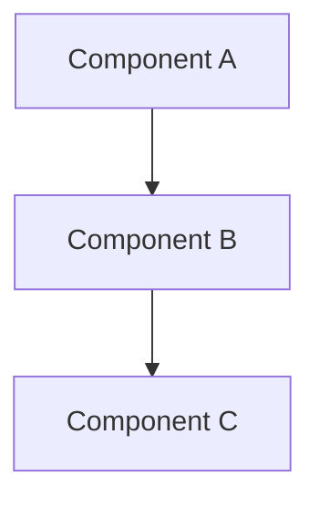
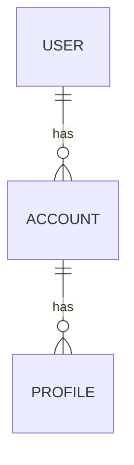
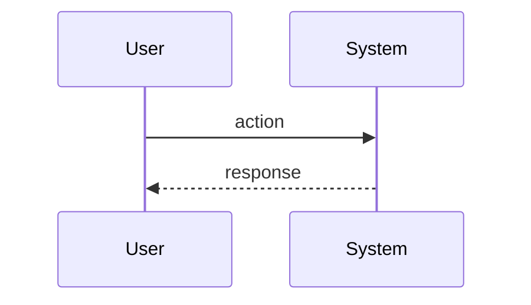

#type/reference #area/joinery #status/active

# Joinery — Personal Coding Framework v1 Specification

**Working repo name:** `joinery` (final name TBD; see §16)
**Author:** Ryan Beam
**Date drafted:** 2026-05-09
**Last polish:** 2026-05-10 — multiple passes (Bucket A + B decisions, polyglot language model, CLI UX section, branching strategy, plan template flexibility + unbounded planning conversation correction)
**Status:** Design specification, pre-build
**Related:** [[research/coding-framework-research-2026-05-09]] | `CLAUDE.md` (project root)

---

## Table of Contents

1. [Overview](#1-overview)
2. [The Carpentry Metaphor](#2-the-carpentry-metaphor)
3. [The Five Phases](#3-the-five-phases)
4. [The Three Tiers](#4-the-three-tiers)
5. [Project Layout](#5-project-layout)
6. [plan.md Template](#6-planmd-template)
7. [Skill Catalog](#7-skill-catalog)
8. [Hook Catalog](#8-hook-catalog)
9. [Learning Module — The Apprentice's Notebook](#9-learning-module--the-apprentices-notebook)
10. [Token Economics](#10-token-economics)
11. [Failure → Rule Mechanic](#11-failure--rule-mechanic)
12. [Adversarial Review](#12-adversarial-review)
13. [Git as Spine](#13-git-as-spine)
14. [Configuration Reference](#14-configuration-reference)
15. [Adopt / Fork / Build Inventory](#15-adopt--fork--build-inventory)
16. [Open Questions + TBDs](#16-open-questions--tbds)
17. [Bibliography](#17-bibliography)
18. [Glossary](#18-glossary)

---

## 1. Overview

### What Joinery is

Joinery is a personal coding framework for the AI-agent era. It is a structured composition of load-bearing patterns — borrowed from the most rigorous practitioners in the field — wired into a single workflow that lets the user design, ship, and **understand** reliable software with strong agent leverage.

It is not a library. It is not a tool. It is a system of files, skills, hooks, conventions, and habits that lives in a repo and gets installed into projects via `workshop init`. The framework's value is in the composition; nothing in it is novel in isolation.

### Audience

- **Primary:** the author — a serious daily user of Claude Code who wants AI leverage without losing comprehension. Builds across Python and TypeScript. Career trajectory in data and software engineering.
- **Secondary:** other developers who want AI leverage with comprehension preserved. Demonstrates a working theory of AI-assisted software craft. May eventually be a public framework.

### Philosophy

Three frames sit underneath every design choice:

1. **Wes McKinney's lens.** "I understand code but rarely write or review it." The role shift is from coder to orchestrator, but **never** from thinker to passenger. Comprehension is the load-bearing skill in the AI era. Agents are the typists.

2. **Carpentry as a real metaphor, not decoration.** The carpenter's discipline — measure twice cut once, the right tool for the job, sharp tools make safe work, joinery is invisible when done right, learn alongside masters — maps cleanly onto AI-assisted software work. The metaphor earns its place by shaping structure, not by surface naming.

3. **Learn-first, ship-second — but still ship production.** Learning is the primary product, especially when the user is still building expertise; shipping is downstream. AI is allowed to expand the *scope* of what the user attempts (Willison: "the benefit is not speed, it's scope"), not skip understanding what gets built. Every framework feature that protects learning is worth its time and token cost.

### The non-negotiables

These constraints are non-negotiable. The framework is invalid if it violates any of them.

- **Human in the loop.** Every commit reflects something the user can explain. No "shipped but don't understand" code on production tier. (Willison's golden rule.)
- **Learning is constant and built in, not bolted on.** Side quests, comprehension audits, and primary/secondary classification are first-class artifacts, toggleable but on by default.
- **Token-conscious.** Defaults reflect cost-awareness. Auto-fire AI checks have cost gates. Token usage is logged and visible. Rigor must earn its tokens.
- **Standalone — no external system dependencies.** Joinery owns its own infrastructure. Any external integration (sync to a personal dashboard, post to a Slack channel, write to Notion, etc.) is a user-supplied adapter, not a framework dependency. If your external system is down, Joinery still works.
- **Modular and toggleable.** Every major capability is an opt-in via `framework.config.toml`. Tier defaults set sensible starts; nothing is forced.

### Design principles

These are decision rules that resolve ambiguity during build and iteration.

1. **Load-bearing convergent over novel.** If multiple respected practitioners (McKinney, Willison, Karpathy, Howard, Beck, Hashimoto, Litt, Anthropic) converge on a pattern, adopt it faithfully. Reserve novelty for composition and specificity, not contradiction.
2. **Lean over comprehensive.** A 5-section plan that gets used beats a 13-section plan that gets skipped. Each section, skill, hook, and artifact must earn its place. Cut anything that doesn't.
3. **Adopt before build.** Always check if a tool exists. If it does, adopt or fork. Build new only when nothing fits. The framework's value is in composition, not invention.
4. **Scars over theory.** CLAUDE.md grows from real failures, not from "best practices" pulled from blog posts. Every rule is a commit linked to the failure that prompted it. (Hashimoto's pattern.)
5. **Git is the spine.** Every artifact lives in git. Commit history is the audit trail, the lessons-learned log, and the comprehension archive. Structured commit messages are required on production tier.
6. **The framework is the product.** 98.4% of the value of Claude Code is harness, not model (VILA Lab). The same is true here. The walls matter more than the model. Joinery's job is to be the walls.

---

## 2. The Carpentry Metaphor

The metaphor isn't decoration. It shapes the structure. Each principle below has a literal mapping into how the framework works.

| Carpentry principle | Joinery mechanism |
|---|---|
| Measure twice, cut once | `plan.md` is required before code on production tier. Failing tests written before implementation. |
| The right tool for the job | Tier system (production / standard / sketch). Don't bring full rigor to a throwaway sketch. |
| Sharp tools make safe work | CLAUDE.md kept tight and load-bearing. Skills small and focused. Each rule earned. |
| Working with the grain | Choose languages with strong AI training data when possible. Translate from supported language to unsupported when necessary (Hashimoto's Zig pattern). |
| Joinery is invisible when done right | Skills compose. Hooks fire silently when checks pass. The framework gets out of the way during cutting. |
| Learn alongside masters | The framework is built from the convergent patterns of named practitioners, not invented in isolation. |
| Each tool earned, not acquired | Rules grow from scars (Hashimoto). Skills added when a real workflow gap appears, not preemptively. |
| Master and apprentice | The user is the master, agent is the apprentice. The apprentice can be skilled but never owns judgment. |
| Finishing matters | Phase 5 (Finishing) is a phase, not an afterthought. Explain-back, ADRs, HANDOVER are required on production. |

The internal terminology preserves the metaphor where it adds clarity:

- **The Workshop** — global config under `~/.config/joinery/`. The tool wall, sharpened over time.
- **The Bench** — per-project workspace, scaffolded by `workshop init`.
- **The Joints** — composable skills (`.claude/skills/`).
- **The Plan on the Bench** — `plan.md`, the source of truth.
- **The Apprentice's Notebook** — `learning/` directory, the side-quests and comprehension audits.
- **The Grain of the Wood** — the codebase. You build with it, not against it.

---

## 3. The Five Phases

The work rhythm. Each phase has a carpentry name, a set of artifacts, a who-does-what split, and a token estimate.

### Phase 1: Sharpening (project init)

**Carpentry frame:** Setting up the bench. Sharpening tools. Laying out the workpiece.

**Trigger:** New project. You bash in, run `workshop init <name> --tier <tier>` (interactive prompts fill any flags you skip). Optional `--lang <python|typescript|polyglot>` flag is a *hint* about scaffolding — the framework does NOT lock the project to that language. Hooks scan files at run time and run language-appropriate tools per-file. You can add a second or third language to a project at any point without re-init.

**Artifacts produced:**
- `.workshop/config.toml` (tier defaults, all toggleable)
- `CLAUDE.md` and `AGENTS.md` (5-rule starter, both files for Cursor/Codex compatibility)
- `.claude/skills/` populated with tier-appropriate skills
- `.git/hooks/` installed per tier
- `plan.md` (blank, structured)
- `learning/` directory scaffolded with empty side-quests, skills-log, comprehension-audits, ratio-log
- `docs/decisions/` (for ADRs)
- `reviews/` (for adversarial review output, if enabled)
- `README.md` skeleton
- Initial commit: "joinery: bench setup, tier=<tier>"

**Who:** Mostly automated. The user picks the tier, optionally answers 2-3 prompts (project type, primary language, learning goals).

**Token cost:** ~500 tokens, one-time per project. Effectively free.

**Tier behavior:** All tiers run init. Difference is what gets installed (see §4 and §14).

---

### Phase 2: Drafting (planning + system design)

**Carpentry frame:** Sketching the design on the bench before any cut.

**Trigger:** Starting work on a feature, project, or significant change. The `/plan` orchestrator skill, or composable sub-skills (`/plan-system`, `/plan-data`, etc.).

**Artifacts produced:**
- `plan.md` populated section-by-section through structured back-and-forth with the agent
- ADR seeds for any non-trivial decisions (formalized in Finishing)
- New side-quest entries for concepts encountered that the user doesn't fully grok

**Who:** Human leads, agent strawmans. Iterative. Strawman → critique → refine. Final plan.md is committed as the source of truth.

**Diagrams:** Mermaid is primary (text-based, agent-readable, renders in IDE/GitHub). Excalidraw for early ideation only. C4 model as conceptual frame (Context → Container → Component → Code) — different zoom levels, used as needed.

**Iteration cadence:** **the planning conversation runs until the plan converges, not until a turn count is hit.** Routine work might converge in 3-5 rounds. Complex work (anything with stacked constraints, integration boundaries, or unfamiliar territory) might take 20+ turns of clarifying questions, context dumps, and out-of-order section refinement. **Hard-capping turns is anti-pattern** — exactly what makes Claude Code's plan mode better than turn-limited tools. The `/plan` orchestrator asks questions liberally, re-asks when answers are vague, surfaces its own uncertainty ("I don't have enough context on X to plan section Y"), and pauses for context dumps when needed. The plan is done when it's done.

**Token cost:** highly variable. Routine plans run ~10-20K tokens. Complex plans with extensive clarifying conversation can run 50-100K. Either is fine — Drafting is the cheapest phase in the long run because a tight plan dramatically reduces Cutting cost (5-10x return). Don't golf token usage in Drafting; let the conversation take as long as it takes.

**Tier behavior:**
- **production:** Plan required (gated). Full template (5 always + 2 conditional sections).
- **standard:** Plan required, advisory. Full template available, can skip conditional sections.
- **sketch:** Plan optional. One-paragraph summary acceptable.

See §6 for the actual template.

---

### Phase 3: Marking (tests + type contracts as the cut lines)

**Carpentry frame:** Marking the cut. Pencil lines on the wood before the saw.

**Trigger:** plan.md complete. The `/mark` skill takes the success criteria from plan.md and writes failing tests + type contracts.

**Artifacts produced:**
- Failing test files (`test_*.py`, `*.test.ts`, etc.) — one test per success criterion
- Type stubs / Pydantic models / TypeScript interfaces from any interface contracts in plan.md
- A "marking notes" section appended to plan.md if test design surfaced new questions

**Who:** Human writes (or directs the agent to write) failing tests that encode the contract. Agent fills in stubs. Human reviews to confirm the tests actually capture the intent.

**Token cost:** ~1-3K tokens for a typical feature. The plan already did the heavy thinking; marking is mechanical translation.

**Tier behavior:**
- **production:** Required before any cutting. CI enforces.
- **standard:** Advisory. Can skip if tests already exist for the affected area.
- **sketch:** Skipped.

The handoff to Cutting is unambiguous: "make these failing tests pass, don't touch anything else."

---

### Phase 4: Cutting (implementation)

**Carpentry frame:** The actual cutting. The saw on the wood. The most physical phase.

**Trigger:** Failing tests + plan in place.

**Artifacts produced:**
- Code that makes the tests pass
- Updates to documentation if interfaces changed
- Atomic commits with structured messages (Lore Protocol-flavored — see §13)

**Who:** Agent does most of the typing. Human directs at higher abstraction, intervenes when scope drifts.

**Three disciplines that matter most:**

1. **Scope discipline.** plan.md listed which files are in scope. Agent surfaces deviations rather than silently fixing. Soft enforcement via CLAUDE.md rule for v1 (token-cheap). Hard enforcement via diff-vs-scope hook later if the soft version proves insufficient.

2. **Deviation surfacing.** If during work the agent realizes the plan is wrong (the data model needs an extra field; an interface is awkward), it pauses and surfaces. Plan gets updated, then continues. Every plan deviation gets logged — these are seeds for future learning.

3. **Atomic commits with structure.** Each commit is one logical unit. Structured message references the plan section it implemented. McKinney's pattern + Lore Protocol. Production tier requires structured commits; standard tier encourages; sketch ignores.

**Token cost:** Bulk of any project. ~50-200K tokens depending on scope. Most efficient when plan is tight and scope discipline holds.

**Tier behavior:**
- **production:** Adversarial review fires post-commit (or on PR; see §12). Scope discipline soft-enforced.
- **standard:** Manual `/review` available; scope discipline advisory.
- **sketch:** Open. Move fast.

---

### Phase 5: Finishing (review, comprehension, handover, learning capture)

**Carpentry frame:** Sanding, finishing, inspecting. The work isn't done when the cut is done.

**Trigger:** Cutting reaches a checkpoint (commit, PR, end of session, end of feature).

**Artifacts produced:**
- Explain-back transcript (agent summarizes what was built, decisions made, tradeoffs)
- ADR if a non-trivial architectural decision was made
- HANDOVER.md (state of work, what's next, what got deferred)
- Adversarial review output in `reviews/<commit>.md` (production tier auto-fires)
- Updated side-quest entries (concepts encountered during cutting that the user didn't fully grok)
- Token usage logged to `.workshop/usage.jsonl` with phase attribution
- Optional: ratio-log entry (was this primary or secondary work?)

**Who:** Agent generates the explain-back, ADR draft, HANDOVER, review. Human reviews and signs off. Comprehension gate is human-only — anything that surprises the user, they dig in before committing.

**The five sub-steps in order:**

1. **Explain-back.** Agent: "What changed, what decisions I made, what tradeoffs I considered, anything surprising." ~1-2K tokens.
2. **Comprehension gate.** The user reads. Anything unexplainable → side quest. Anything surprising → dig in. Non-negotiable.
3. **ADR if warranted.** Triggered by a non-trivial choice. ~1K tokens. Linked from plan.md.
4. **HANDOVER.md.** State of work, what's next. ~500 tokens. Read at next session start.
5. **Adversarial review** (if enabled at this tier and trigger). See §12. ~5-15K tokens.

**Token cost:**
- Without review: ~3-5K tokens.
- With review: ~10-25K tokens depending on diff size.

**Tier behavior:**
- **production:** All sub-steps run. Review auto-fires per config. Comprehension gate required.
- **standard:** Explain-back + HANDOVER. ADRs optional. Review manual. Comprehension gate encouraged.
- **sketch:** Explain-back only. Brief HANDOVER if you'll return to it.

---

### Token estimate for a full production feature

| Phase | Tokens (rough) |
|---|---|
| Sharpening | ~500 (one-time per project, not per feature) |
| Drafting | 10-20K |
| Marking | 1-3K |
| Cutting | 50-200K |
| Finishing (no review) | 3-5K |
| Finishing (with review) | +5-15K |
| **Total per production feature** | **~70-240K** |

Framework overhead (everything that isn't raw cutting) is ~15-25K — call it ~10-30% of total. That's the price of rigor. Token logging makes the price visible so it can be tuned.

---

## 4. The Three Tiers

Tiers configure defaults. They are not categories of project — they are *risk profiles*. A 50-line bash script that controls production payments belongs in the production tier. A 5,000-line Next.js app you'll throw away after a hackathon belongs in sketch.

### Production tier

**When:** Real users, real money, real consequences. Anything publicly deployed. Anything touching payments, auth, or PII. Examples: a customer-facing web app, a deployed API, a script that buys things or moves money.

**Defaults:**
- `plan_gate = required` (no cutting without plan.md)
- `tdd_gate = required` (no cutting without failing tests)
- `adr_required = true` (architectural decisions logged)
- `type_safety = strict`
- `adversarial_review = post-commit` (with cost gates; see §12)
- `dependency_budget = enforced` (max N new deps per feature, configurable)
- `security_review = on` (security-focused review on PR)
- `explain_back = true`
- `side_quest_journal = true`
- `weekly_digest = true`
- `token_logging = true`
- `commit_structure = enforced` (structured messages required)

### Standard tier

**When:** Personal serious projects. Side builds you intend to keep but aren't shipping to others. Internal tools. Anything you'll come back to in 3 months and want to still understand.

**Defaults:**
- `plan_gate = required` (advisory only — no CI enforcement)
- `tdd_gate = advisory`
- `adr_required = false`
- `type_safety = advisory`
- `adversarial_review = pr-only`
- `dependency_budget = advisory`
- `security_review = manual`
- `explain_back = true`
- `side_quest_journal = true`
- `weekly_digest = true`
- `token_logging = true`
- `commit_structure = encouraged`

### Sketch tier

**When:** Throwaways. Learning experiments. Willison-style HTML/JS toys built in 30 minutes and discarded. Notebook explorations.

**Defaults:**
- `plan_gate = off`
- `tdd_gate = off`
- `adr_required = false`
- `type_safety = off`
- `adversarial_review = off`
- `dependency_budget = off`
- `security_review = off`
- `explain_back = true` (always — comprehension never optional)
- `side_quest_journal = true` (always — learning never optional)
- `weekly_digest = true`
- `token_logging = true`
- `commit_structure = off`

**Critical observation:** even sketch tier preserves the learning module + token logging + explain-back. These are the non-negotiables, expressed as defaults that can't be turned off cheaply. Everything else is opt-in per tier.

### Tier override

`workshop init <name> --tier <tier>` sets the default. Any individual feature flag can be overridden in `.workshop/config.toml` post-init. Tiers are starting points, not cages.

### Tier promotion

`workshop promote <project> --to <tier>` upgrades a scaffold in place. Sketches that earn their keep can graduate to standard or production without re-init. The command:
- Adds missing directories (e.g., `tests/`, `reviews/`, `docs/decisions/`)
- Installs missing skills (e.g., `mark.md`, `review.md`, `adr.md`)
- Installs missing hooks (post-commit, pre-push, commit-msg)
- Updates `.workshop/config.toml` to the new tier's defaults
- Records the promotion as a commit ("workshop: promoted from sketch to standard at 2026-05-12")
- Never deletes anything — promotion is additive

Demotion is intentionally not supported. If a project no longer needs production rigor, you're probably ready to delete or archive it.

---

## 5. Project Layout

What `workshop init` produces, file-by-file. Reflects production tier; sketch tier omits some files; standard tier in between.

```
project-root/
├── .workshop/
│   ├── config.toml              # Feature flags + tier defaults
│   ├── usage.jsonl              # Token usage log (one line per agent invocation)
│   └── tier.lock                # Records the tier this project was init'd at
├── .claude/
│   └── skills/
│       ├── plan.md              # Orchestrator skill
│       ├── plan-system.md
│       ├── plan-data.md
│       ├── plan-flows.md
│       ├── plan-contracts.md
│       ├── plan-risks.md
│       ├── plan-decisions.md
│       ├── plan-side-quests.md
│       ├── mark.md              # Test scaffolding from plan.md
│       ├── explain-back.md      # Comprehension gate
│       ├── handover.md          # Session handoff
│       ├── review.md            # Adversarial review (manual)
│       ├── rule.md              # Failure → CLAUDE.md rule
│       ├── sq.md                # Manual side quest entry
│       └── adr.md               # Decision record creation
├── .git/
│   └── hooks/
│       ├── pre-commit           # Lint, type-check, test (deterministic)
│       ├── post-commit          # Adversarial review trigger (production tier)
│       ├── pre-push             # Branch protection checks (production tier)
│       └── commit-msg           # Lore Protocol structure check (production tier)
├── docs/                        # Documentation system (see §13)
│   ├── README.md                # Docs index
│   ├── architecture.md          # Current system design
│   ├── getting-started.md       # Onboarding (install, run, develop)
│   ├── decisions/               # ADRs
│   │   └── 0001-tier-selection.md  # Auto-created at init
│   ├── operations/              # Runbooks (production tier)
│   │   ├── deploy.md
│   │   └── troubleshooting.md
│   ├── reference/               # API/CLI/config reference (production tier)
│   │   └── README.md
│   ├── changelog.md             # Version history (auto-updated)
│   └── handovers/               # Per-session handoffs (archived)
├── learning/
│   ├── side-quests.md           # "I don't fully grok this" log
│   ├── skills-log.md            # Concepts I now understand
│   ├── comprehension-audits.md  # Weekly self-test
│   ├── ratio-log.jsonl          # Primary/secondary tracking
│   └── weekly-digests/          # Generated digests, archived
├── reviews/                     # Adversarial review output
├── tests/                       # Failing tests (Marking phase output)
├── CLAUDE.md                    # Project-specific rules (5-rule starter — see §11)
├── AGENTS.md                    # Mirror of CLAUDE.md, maintained by pre-commit hook
├── HANDOVER.md                  # Most recent session handoff (overwritten each session)
├── plan.md                      # The current plan
└── README.md                    # Project README skeleton
```

**Global config (the Workshop):**

```
~/.config/joinery/
├── CLAUDE.md                    # Global rules that apply to every project
├── skills/                      # Skills available everywhere
├── templates/
│   ├── plan-template.md
│   ├── adr-template.md
│   ├── handover-template.md
│   └── claude-md-starter.md
└── joinery-config.toml          # Global defaults (tier presets, default skills, etc.)
```

`workshop init` reads the global config to populate project defaults, then can be customized per-project.

### Sketch tier scaffold (the minimal set)

Sketch tier deliberately strips most of the layout. What it keeps preserves the non-negotiables:

```
sketch-project/
├── .workshop/
│   ├── config.toml          # tier=sketch
│   ├── usage.jsonl
│   └── tier.lock
├── .claude/skills/
│   ├── plan.md              # sketch variant — single-paragraph allowed
│   ├── explain-back.md      # NON-NEGOTIABLE — comprehension never optional
│   └── sq.md                # side quests still log
├── .git/hooks/
│   └── pre-commit           # lint only (no type-check, no tests)
├── learning/
│   ├── side-quests.md       # KEEP — sketches generate the most side quests
│   ├── ratio-log.jsonl      # KEEP — primary/secondary lightweight
│   └── weekly-digests/      # KEEP — global digest still rolls up sketch hours
├── CLAUDE.md                # minimal, copied from global
├── HANDOVER.md
├── plan.md                  # single-paragraph variant
└── README.md
```

**Sketch tier explicitly skips:** `tests/`, `reviews/`, `docs/decisions/`, `docs/handovers/`, `comprehension-audits.md`, post-commit / pre-push / commit-msg hooks, and the `mark` / `review` / `adr` / `handover` / `rule` skills (still globally available, just not project-scaffolded).

**Sketch + git:** `git init` runs by default. `--no-git` flag skips it for true throwaways.

### Workshop binary host

The `workshop` CLI ships in **Python** (click-based). Stdlib gives `tomllib` + `pathlib` + `subprocess` for everything the binary needs. One small dep (`click`). Clean Windows + Linux behavior. Easy to read and modify.

Distribution: `pipx install joinery-cli` (single command, isolated venv, no global pollution).

### CLI UX and onboarding

A framework with bad onboarding is a framework people don't keep using. The CLI's UX has to be considered as part of the framework, not as decoration.

**Design principles for the CLI:**
- **Quiet competence over theatrics.** No ASCII art, no loading bars, no mascots. Carpentry-themed copy where it adds clarity ("bench is set up", "workshop is sharpened"); plain English everywhere else.
- **Educational at decision points.** When the user picks a tier, the prompt explains what tiers mean. They learn the framework while using it, not by reading docs first.
- **Interactive when flags missing, flag-driven when flags passed.** Power users skip prompts; first-timers get walked through. Click's `prompt=True` does this natively.
- **Errors are one-liners that name the rule and point at the fix.** No stack traces for expected failures (existing dir, missing config, broken hook). Stack traces only for genuine bugs.
- **Post-action clarity.** After every command, print what changed and what to do next.

#### First-run experience

When the user types `workshop` for the first time after `pipx install joinery-cli`:

```
Welcome to Joinery.

The workshop hasn't been set up on this machine yet. Run:
  workshop setup       to install the workshop-level config
  workshop --help      to see all commands
  workshop init        to scaffold a new project (will prompt you)
```

Detection: workshop checks for `~/.config/joinery/CLAUDE.md`. If absent, prints the welcome. If present, prints a terse status line and the help summary.

#### `workshop setup` (one-time, system-wide)

Run once per machine. Installs the workshop-level config to `~/.config/joinery/`.

```
$ workshop setup

Setting up your workshop.

This will install workshop-level config files at:
  ~/.config/joinery/
    CLAUDE.md         workshop-level coding standards (no emojis, ISO dates, etc.)
    skills/           globally available skills (rule, sq, audit, digest)
    templates/        templates that workshop init copies into new projects

Existing files (if any) will be backed up to ~/.config/joinery.bak-2026-05-10/.

Continue? [Y/n]: Y

Installed.

Joinery recommends ccstatusline for token-usage visibility. We can't install it
automatically (it requires interactive TUI configuration). When you're ready:

  npx -y ccstatusline@latest

Run in a real terminal (not via Claude Code's bash prefix).

Workshop is sharpened. Try `workshop init my-project --tier production` to scaffold
your first project, or `workshop init` for an interactive walkthrough.
```

#### `workshop init` — interactive mode

When run without flags, prompts step-by-step. Each prompt explains what's being asked.

```
$ workshop init

Project name: my-project

Choose tier:
  > production    Real users, real money, real consequences. Full rigor.
    standard      Personal serious projects. Most gates advisory.
    sketch        Throwaways. Just the non-negotiables (learning + comprehension).

Tip: tiers are risk profiles, not project sizes. A 50-line bash script touching
production payments belongs in production tier.

[production]: production

Primary language? (this only affects what gets scaffolded — projects can be polyglot)
  > python
    typescript
    polyglot      both pyproject.toml and package.json scaffolded

[python]: python

Initialize git? [Y/n]: Y

Creating my-project/
  + README.md
  + LICENSE
  + CLAUDE.md (5 starter rules)
  + plan.md (production tier template)
  + .claude/skills/ (16 skills installed)
  + .git/hooks/ (5 hooks installed)
  + learning/ (apprentice's notebook ready)
  + .workshop/config.toml (production tier defaults)
  + pyproject.toml (Python primary)

Bench is set up. Next:
  cd my-project
  workshop session start         # read HANDOVER, run preflight
  /plan                          # draft your first plan with the agent

Read CLAUDE.md and plan.md before your first session. They're worth the 5 minutes.
```

#### `workshop init` — flag-driven mode

When all flags are passed, no prompts. Runs in under 2 seconds.

```
$ workshop init my-project --tier production --lang python --git
Creating my-project/ ... done.

Bench is set up. cd my-project && workshop session start to begin.
```

#### `workshop session start` output

```
$ workshop session start

Last session ended 2026-05-09 16:42 (about 18 hours ago).
HANDOVER says: "Form validation pattern in scope; useDeferredValue still a side quest."

Preflight:
  git status:           clean
  CI on branch:         green (last run 2 hours ago)
  Tests:                passing (last run with current diff)
  plan.md freshness:    updated 2 days ago (production tier OK)

Active side quests: 3 open (oldest: SQ-031, 6 days)
This week's primary/secondary ratio: 60% primary / 40% secondary (target: ≤70% secondary). HEALTHY

Workshop is open. Ready when you are.
```

#### `workshop doctor` output

Clean state:
```
$ workshop doctor

Workshop:
  ~/.config/joinery/         present
  global CLAUDE.md           up to date
  statusline                 ccstatusline configured
  pipx                       joinery-cli v0.1.0 installed

Project (my-project):
  .workshop/config.toml      valid (tier=production)
  .claude/skills/            16/16 skills present
  .git/hooks/                5/5 hooks installed and executable
  CLAUDE.md ↔ AGENTS.md      in sync
  plan.md                    fresh (updated today)

Healthy.
```

Broken state:
```
$ workshop doctor

Project (my-project):
  .workshop/config.toml      valid
  .claude/skills/            14/16 skills present (MISSING: review.md, audit.md)
  .git/hooks/                4/5 hooks installed (MISSING: commit-msg)
  CLAUDE.md ↔ AGENTS.md      OUT OF SYNC (CLAUDE.md modified after AGENTS.md)
  plan.md                    stale (last updated 18 days ago, production tier wants ≤14)

3 issues found. Fix with:
  workshop repair my-project         # restores missing skills/hooks, syncs AGENTS.md
  workshop session start              # then refresh plan.md before cutting

Or fix manually — doctor is advisory, not enforced.
```

#### Error formatting

Expected failures are one-liners that name the rule and point at the fix:

```
$ workshop init my-project
Error: directory `my-project/` already exists. Pick a different name or `rm -rf my-project/` first.
```

```
$ git commit -m "small thing"
Error: commit-msg hook rejected.
  This commit changed 47 lines (above the 10-line threshold for trivial commits).
  Production tier requires Lore Protocol structure (context/considered/decided).
  See: joinery spec §13 — or run `workshop help commit-format`.
```

Stack traces only on genuine bugs. Catch and rewrap any expected exception.

#### Carpentry-themed copy

Used sparingly, where it carries meaning:
- "Bench is set up" — after `workshop init`
- "Workshop is sharpened" — after `workshop setup`
- "Workshop is open" — after `workshop session start`
- "Bench is clean" — after `workshop session end` with no open side quests

Avoided:
- Carpentry vocabulary in error messages (errors should be plain English)
- Carpentry vocabulary in `--help` output (clarity over flavor)
- Repeated branding (mention Joinery once in welcome, not in every command output)

---

## 6. plan.md Template

The fillable template. Production tier requires sections 1-5 always + 6-7 when conditionally applicable. Standard tier all optional. Sketch tier writes a single paragraph instead.

**Critical principle: lengths are flexible.** A typo-fix plan might be one sentence per section; a complex production system plan might have a Problem section that's 15 paragraphs of stacked constraints, prior research, and history. The template's job is to **guide structure**, not to **cap length**. Each section header below shows a *minimum* of what to capture, not a maximum.

**Context dumps are first-class.** Real projects often start from prior research, planning conversations, or stakeholder transcripts. A new optional **Section 0 (Context)** lets you paste those in raw — no polish required, no shoehorning into rigid sections.

```markdown
# Plan: <project or feature name>

**Status:** drafting | active | complete | abandoned
**Tier:** production | standard | sketch
**Last updated:** YYYY-MM-DD
**Related:** [links to ADRs, prior plans, HANDOVERs]

---

## 0. Context (OPTIONAL — paste prior planning, research, transcripts)

<Whatever forms the foundation of this plan. Research notes, transcripts of stakeholder conversations, prior planning docs, links to related work. Raw and unpolished is fine — this is the workshop floor before the project starts. Skip entirely if not applicable.

Length: as much as needed. Some plans have no context section; some have 200 lines of prior thinking dumped here. Both fine.>

## 1. Problem

<What needs solving, why, who it's for, when it matters. Capture enough that a stranger could understand the problem cold.

Length: as much as needed. One sentence for trivial work. Multiple paragraphs covering history, constraints, prior failed approaches, and current state for complex work. The right length is "enough that the problem is genuinely clear," not "one paragraph">

## 2. Approach

<The strawman. How we plan to solve it. Include Mermaid architecture diagram for non-trivial systems. Include a "what could go wrong" paragraph that flags risks inline.

Length: as much as needed. Trivial fixes might be a sentence. Complex systems might have multiple sub-sections covering subsystems, integration boundaries, failure modes, rollout strategy.>



**Files in scope:** <list paths the agent is allowed to touch>

## 3. Success criteria

<Testable assertions. Each one becomes a failing test in Phase 3. Be specific.

Bad: "performance is fast." Good: "P50 latency < 200ms under 100 concurrent requests."
Bad: "handles edge cases." Good: "rejects empty input with 400 + 'name required' message."

Length: as many as the problem has. 3 criteria for a small fix; 30 for a complex feature. Don't artificially compress.>

- [ ] When X happens, Y produces Z
- [ ] Edge case A is handled by B
- [ ] Performance: P50 latency < N ms
- [ ] ...

## 4. Forbidden actions

<What the agent must never do during cutting. Devin Playbook pattern. These are the rails.

Length: 3-5 bullets typical, more for sensitive systems. Concision matters here — vague rails don't enforce.>

- Do not modify <path> outside the listed scope
- Do not add new dependencies without surfacing first
- Do not skip the failing test handoff
- Do not delete or disable existing tests
- ...

## 5. Side quests

<Concepts, libraries, or patterns that appeared in this plan and you don't fully grok yet. Each gets logged to `learning/side-quests.md` automatically.>

- [ ] [concept]: <one-line "what I don't get yet">
- [ ] ...

## 6. Data model (CONDITIONAL — include if persistent state)

<Mermaid ER diagram + brief notes on entity decisions.>



## 7. Critical flows (CONDITIONAL — include if non-trivial interactions)

<Mermaid sequence diagrams for the 2-3 most important user/system journeys. Skip if the system has only one obvious flow.>



---

## Decisions log (appended during work)

<Each non-trivial decision links to its ADR. Filled in during cutting, not pre-written.>

- [ADR-0042](docs/decisions/0042-...) — chose X over Y because Z
- ...
```

**What we explicitly cut from earlier drafts:**

- "System sketch" as a separate section — folded into Approach.
- "Interface contracts" — your tests are the contract.
- "Test plan" — duplicates success criteria.
- "Risks + threats" as a separate section — folded into Approach.
- "Dependency budget" — moved to `.workshop/config.toml` (one config line, not a plan section).

This brings the template to **6 sections (1 optional + 5 always) + 2 conditional = 5-8 sections.** Each section earns its place by having a downstream consumer in the framework. Lengths within each section are unbounded.

### How `/plan` actually drives this

`/plan` is not a form-fill. It's an unbounded planning conversation. The orchestrator skill:

- **Asks clarifying questions liberally** — re-asks when answers are vague, surfaces its own uncertainty ("I don't have enough context on the eBay refund flow to plan section 7 — can you walk me through it?").
- **Pauses for context dumps** — "before we go further, paste in the prior research or any planning docs that should anchor this." That content goes into Section 0.
- **Iterates sections in any order** — Approach might need Data model resolved first; Forbidden actions might emerge from Critical flows. The orchestrator doesn't force linear order.
- **Refines until convergence** — the plan is done when it's done. No turn count. Routine work converges in 3-5 rounds; complex work might take 20+ rounds. Both are correct.
- **Surfaces side quests as it goes** — concepts you don't fully understand get captured at plan time, not after.
- **Re-uses prior planning** — if a previous plan or HANDOVER touched this area, the orchestrator pulls it in as Section 0 context automatically.

This matches how Claude Code's plan mode works: question-driven, paced by understanding, output is a finished plan when one exists. Forced turn limits would defeat the purpose.

### Integration with Claude Code plan mode

Joinery's `/plan` skill **adopts** Claude Code's built-in plan mode rather than reinventing the conversation loop. Per the framework's "Adopt > Fork > Build" principle: Claude Code already has a question-driven, no-turn-cap, read-only-until-approved planning mode. Joinery shapes the *output* rather than duplicating the *mechanism*.

**Inside Claude Code:**

1. User invokes `/plan` (the Joinery skill).
2. The skill instructs the user to enter plan mode (Shift+Tab in Claude Code, or whatever the user's binding is) and provides the 7-section target structure as part of the agent's context.
3. The agent in plan mode drives the unbounded conversation natively — plan mode IS question-driven and turn-uncapped. Reads files freely, makes no edits.
4. When the agent calls `ExitPlanMode` with the proposed plan, the proposal is structured per Joinery's template (because the skill prompted for that shape).
5. User reviews and approves the plan via plan mode's standard approval flow.
6. Joinery captures the approved plan text and writes `plan.md` with the structured content.
7. Joinery post-processes: extracts Side Quest entries to `learning/side-quests.md`, seeds the Decisions log section, sets frontmatter metadata (status, tier, date, related links).

**Outside Claude Code (Cursor, Codex, raw API, other agents):**

Plan mode is a Claude-Code-specific UI affordance, but the *behavior* (unbounded conversation, clarifying questions, structured output) is encodeable in skill prose. The agent follows the skill instructions without a mode switch — same end result, no platform-specific dependency. The skill works in any agent that reads markdown skill files; only the entry-point gesture differs.

**Why this integration matters:**

- **No reinvention.** Plan mode's question-driven behavior is exactly what Joinery needs. Building a parallel mechanism would be wasteful.
- **Standard user affordance.** Anyone using Claude Code already knows how plan mode works; Joinery doesn't ask them to learn a different planning ritual.
- **Approval flow is already solved.** Plan mode gates on user approval before exit. Joinery inherits that gate for free.
- **Graceful degradation.** The same skill works in non-Claude-Code agents without modification.

---

## 7. Skill Catalog

Every named skill, its purpose, when it fires, who triggers it, and approximate token cost.

### Planning skills (composable)

| Skill | Purpose | Trigger | Cost |
|---|---|---|---|
| `/plan` | Orchestrator. Reads tier from config, composes the right sub-skills, drives an unbounded planning conversation (asks clarifying questions, pauses for context dumps, iterates until convergence — no turn cap). | Manual on new feature | highly variable — 10-20K for routine work, 50-100K+ for complex plans with extensive context dumps |
| `/plan-system` | System sketch with Mermaid architecture diagram. | Composed by `/plan` or manual | ~2-3K |
| `/plan-data` | Data model with Mermaid ER. (Conditional.) | Composed by `/plan` or manual | ~2-3K |
| `/plan-flows` | Critical flows as Mermaid sequence diagrams. (Conditional.) | Composed by `/plan` or manual | ~2-3K |
| `/plan-decisions` | Surfaces decisions made during planning, drafts ADRs for each. | End of `/plan`, or manual | ~1-2K |
| `/plan-side-quests` | Scans plan for concepts user doesn't grok, logs to learning module. | End of `/plan`, or manual | ~1K |

### Workflow skills

| Skill | Purpose | Trigger | Cost |
|---|---|---|---|
| `/mark` | Translates plan success criteria into failing test files. | After `/plan` completes | ~1-3K |
| `/explain-back` | Agent summarizes what was built, decisions made, tradeoffs. | End of session, before commit on production tier | ~1-2K |
| `/handover` | Generates HANDOVER.md from current session state. | End of session | ~500 |
| `/review` | Adversarial review by a different model. | Manual, or auto-fires per config | ~5-15K |
| `/security-review` | Security-focused review. | Manual, or PR trigger on production tier | ~5-15K |
| `/adr <title>` | Creates a new ADR from a decision. | When a non-trivial decision is made | ~1K |
| `/pr` | Generates PR description from `plan.md` + branch diff. Lore Protocol-flavored body (context / considered / decided / ref). Used at branch → PR transition. | Manual, before opening a PR | ~1-2K |
| `/docs` | Orchestrator. Surveys `docs/` state, asks what needs updating, composes the right sub-skills (changelog / getting-started / architecture). Index regenerated automatically. | Manual, or auto-fires when "docs need updating" surfaces in conversation | ~2-5K |
| `/docs-changelog` | Updates `docs/changelog.md` from recent commits + new ADRs since last update. | Manual, or auto-runs in weekly digest | ~1-2K |
| `/docs-getting-started` | Refreshes `docs/getting-started.md` from current project state (reads pyproject.toml/package.json, scripts, install steps). | Manual, when setup process changes | ~1-2K |
| `/docs-architecture` | Refreshes `docs/architecture.md` from current code structure + relevant ADRs. | Manual, when architecture changes meaningfully | ~3-5K |

### Discipline skills

| Skill | Purpose | Trigger | Cost |
|---|---|---|---|
| `/rule` | Captures a failure as a new CLAUDE.md rule. | After any failure | ~500 |
| `/sq <concept>` | Manual side quest entry. | When user spots a concept they don't grok | ~200 |
| `/audit` | Scaffolds the weekly comprehension audit (selects a recent commit, prompts you for a cold explanation, files SQ entries from the gaps you surface). The skill scaffolds — you write the explanation. | Sundays | ~1K |
| `/digest` | Generates the weekly digest. Flags `audit_run_this_week: false` if `/audit` hasn't fired. | Sundays | ~1-2K |

### Session skills

| Skill | Purpose | Trigger | Cost |
|---|---|---|---|
| `workshop session start` | See expansion below. | Beginning of session | ~500 |
| `workshop session end` | See expansion below. | End of session | ~3-5K |

**`workshop session start` expanded:**
1. Reads `HANDOVER.md` (last session's state) and prints the "what's next" block.
2. Runs preflight: `git status` (warns on dirty tree), `gh pr checks` if a PR exists for the branch, lints + types + tests if config allows.
3. Verifies `plan.md` is up to date (production tier: refuses to start cutting if plan is stale per its `Last updated` field > 14 days old).
4. Loads context: prints active side quests, last 3 ADRs, today's primary/secondary ratio target.

**`workshop session end` expanded:**
1. Runs `/explain-back` against the session's commits.
2. Runs `/handover` to overwrite `HANDOVER.md` with current state.
3. Reconciles side quests: any SQ-NNN that was opened this session and is still open gets a status check.
4. Prompts for primary/secondary classification (one question, ~5 sec).
5. Aggregates `.workshop/usage.jsonl` for this session, prints phase-by-phase token report.
6. Commits the learning module updates as a single "session: <summary>" commit if anything changed.

**Notes on the catalog:**

- Skills are small and focused. No mega-skills that try to do everything.
- Composability beats consolidation. `/plan` is an orchestrator that composes; the sub-skills work standalone for refinement.
- Token costs are estimates; actual costs logged in `.workshop/usage.jsonl` per invocation.

**Anti-bloat discipline (cuts made 2026-05-10):**

- **`/plan-contracts` cut.** Tests are the contract. Type stubs come naturally from `/mark` (Phase 3 marking). If interface signatures need standalone treatment for an SDK, `/plan-data` covers it. Fewer files, same coverage.
- **`/plan-risks` cut as a standalone skill.** Risks belong inline in Approach (per the plan template — "what could go wrong" paragraph). The `/plan-system` skill already covers risk surfacing. A separate skill duplicates without adding rigor.

Pre-cut: 25 skills. Post-cut: 23. The discipline is "cut anything that doesn't earn its place" — same as we did to the plan template (13 sections → 5+2). Each skill must have a clear "when to use" trigger that doesn't overlap with another skill.

### Invocation modes — when each skill fires

Slashing manually for every action would be friction the framework can't afford. Most skills auto-invoke. Only three resist auto-invocation by design.

**Auto-invoke (most skills).** The agent reads the skill's frontmatter `description` field and triggers the skill when the user's natural language matches. Same mechanism Claude Code uses for any registered skill.

| User says | Auto-invokes |
|---|---|
| "let's plan X" / "plan this" / "design X" | `/plan` |
| "I'm wrapping up" / "end of session" / "pause here" | `/handover` (and `workshop session end` if in framework context) |
| "walk me through what we built" / "summarize what changed" | `/explain-back` |
| "I don't fully understand X" / "what is X" / "why does X work that way" | `/sq` |
| "open a PR" / "send for review" / "merge this branch" | `/pr` |
| "we just decided X over Y" / "log this decision" | `/adr` |
| "weekly digest" / "how was my week" | `/digest` |
| "review this code" / "give me a second opinion" | `/review` |
| "this is a system sketch" / "draw the architecture" | `/plan-system` (typically composed by `/plan`) |
| "data model for X" | `/plan-data` (typically composed by `/plan`) |

**Manual-only (intentional friction).** Three skills resist auto-invocation by design:

- **`/rule`** — you decide when a real failure deserves a CLAUDE.md rule. Auto-firing would create rule bloat from every minor friction. Hashimoto's discipline depends on intentionality (3-strikes rule before promotion).
- **`/audit`** — weekly ritual, triggered Sundays manually (or by a calendar reminder, scheduled cron job, or other external nudge). Auto-firing would dilute the practice.
- **`/security-review`** — deliberate, focused, expensive. User decides when a path warrants it.

**Hook-fired (framework triggers automatically).** No slash, no natural language. The framework's hooks or session commands invoke these:

- **`/review`** — fired by post-commit hook on production tier (cost-gated).
- **`/explain-back`** — invoked by `workshop session end`.
- **`/handover`** — invoked by `workshop session end`.
- **`/mark`** — fired by `/plan` orchestrator when planning completes.
- **`/plan-decisions`, `/plan-side-quests`** — composed by `/plan` near the end of a planning conversation.

**Implication for skill writers:** every skill's frontmatter `description` field is load-bearing. Vague descriptions = unreliable auto-firing = friction. Phase 2 of the build plan treats this as a hard quality bar — each skill's `description` must explicitly list trigger phrases.

Example skill frontmatter:
```yaml
---
name: sq
description: Captures a side quest entry — a concept the user doesn't fully understand yet. Triggers when user says "I don't get X", "what is X", "why does X work that way", "I'm fuzzy on X", or expresses uncertainty about a technical concept. Also auto-invoked by /plan when concepts surface during planning.
---
```

---

## 8. Hook Catalog

Git hooks installed by `workshop init`. Tier-aware — different hooks installed at different tiers.

### pre-commit (all tiers, content varies)

**Purpose:** Deterministic checks before any commit lands.

**Production tier:** Linter + type checker + test suite + commit message structure check (Lore Protocol). Fails the commit if any check fails.

**Standard tier:** Linter + type checker. Tests advisory.

**Sketch tier:** Linter only.

**Token cost:** Zero — these are deterministic, not AI-driven.

### post-commit (production tier only by default)

**Purpose:** Trigger adversarial review after a commit lands.

**Action:** Calls the review skill with the diff. Cost gates apply (skip if diff < N lines, configurable). Output written to `reviews/<commit>.md`. Critical findings open a follow-up issue or block the next push.

**Token cost:** ~5-15K per fire (after cost gate). Skipped on trivial commits.

### pre-push (production tier)

**Purpose:** Last-line-of-defense before code leaves the local machine.

**Action:** Verifies CI is green on the branch (if pushed previously), all tests pass, no critical review findings outstanding. **Also refuses direct pushes to `main` on production tier** (per `[git.branching] require_branch = true`) — forces a feature branch + PR. Refuses push if any check fails.

**Token cost:** Zero.

### commit-msg (production tier)

**Purpose:** Enforce structured commit message format (Lore Protocol-flavored).

**Action:** Validates the commit message has the required sections (context, considered, decided, when applicable). Rejects commits that don't.

**Token cost:** Zero.

### post-merge (optional, all tiers)

**Purpose:** Re-run preflight after pulling/merging changes.

**Action:** Verifies tests still pass. Updates HANDOVER if there's an active session.

**Token cost:** Zero.

**Hook implementation:** v1 hooks are bash scripts shipped with the framework. Each is < 50 lines. They invoke skills via the Claude Code CLI when AI checks are needed; otherwise they shell out to deterministic tools (linter, type checker, test runner).

---

## 9. Learning Module — The Apprentice's Notebook

The most important part of the framework after the phases themselves. Without this layer, Joinery is just another opinionated tool. With it, the framework actively defends the user's skill development.

### Directory structure

```
learning/
├── side-quests.md              # "I don't fully grok this" log
├── skills-log.md               # Concepts I now actually understand
├── comprehension-audits.md     # Weekly self-test results
├── ratio-log.jsonl             # Primary/secondary classification per session
└── weekly-digests/             # Archived weekly digests
    ├── 2026-W19.md
    └── ...
```

### `side-quests.md` — capture is mostly automatic

**Format per entry:**

```markdown
## SQ-042: useDeferredValue
- **Captured:** 2026-05-09 14:32
- **Where:** plan.md §6 critical flow, a form submission
- **What I don't get:** When does it actually defer vs. immediately update? Difference from useTransition?
- **Status:** open
- **Resources collected:**
  - [ ] React docs page on useDeferredValue
  - [ ] Dan Abramov's transitions deep dive
- **What I now understand:** (filled when status → done)
```

**Capture paths:**
1. **Automatic during cutting:** Agent flags when it uses a concept the user didn't engage with in the plan. "I'm reaching for useDeferredValue here. You didn't address this in the plan — is this familiar to you, or should I log a side quest?" If unfamiliar → entry created.
2. **Automatic during planning:** `/plan-side-quests` scans the finished plan for concepts and asks the user to flag unknowns.
3. **Manual:** `/sq <concept>` command. ~5 seconds, ~200 tokens.

**Closure:** `/sq close SQ-042` after a learning session. Status → done. "What I now understand" filled in. Entry stays in file forever (don't delete — track learning over time).

### `skills-log.md` — the durable record

**Format per entry:**

```markdown
## 2026-05-09 — useDeferredValue
- **Source:** SQ-042, React docs, Abramov transitions post
- **What I now understand:** useDeferredValue takes a value and returns a delayed version. Unlike useTransition, you don't control the trigger — React decides when to update based on priority. Useful when you want to keep an input snappy while a derived render is expensive.
- **Used since:** form input filtering feature (commit abc1234)
```

Append-only. Each entry is your durable record of what's actually internalized. Becomes weekly review fodder when synced. Answers "what have I learned this semester" without guessing.

### `comprehension-audits.md` — the weekly self-test

**Cadence:** Sundays, ~10 minutes.

**Format per audit:**

```markdown
## Week 2026-W19 (2026-05-04 to 2026-05-10)

**Audited:** a form submission flow (commit a1b2c3)
**Cold explanation:**
> The form uses useDeferredValue on the search input so that...
> Validation runs on the deferred value, not the raw input...
> Submission posts to /api/leads which...

**Gaps found:**
- I waved hands at why we use useDeferredValue vs. useTransition. Need to revisit. → SQ-058
- Couldn't explain the validation library's API surface cleanly. → SQ-059

**Score:** 3/5 — solid on the flow, weak on the React primitive choice.
```

**Discipline:** Score < 3 = comprehension debt. Pay it before the next big build. Honest scoring is the only thing that makes this real.

**Cadence — tied to work signals, not calendar dates.** A scheduled "every Sunday" audit is a weak proxy: some weeks you ship 50 commits and need one mid-week; some weeks you ship nothing and a Sunday audit is theater. Joinery's audit cadence is **trigger-based**, configurable per project.

Default trigger: **"every 20 commits OR 14 days, whichever comes first."** Active work weeks audit on real volume; slow weeks still get caught by the fallback. The framework prompts via `/digest` ("you've shipped 23 commits since last audit — time to run `/audit`?") rather than waiting for a calendar day.

Configurable triggers (`[learning] audit_trigger` in config):

| Trigger value | Behavior |
|---|---|
| `"20 commits OR 14 days"` (default) | Hybrid — fires on either condition |
| `"N commits"` | Volume-only |
| `"N days"` | Pure calendar |
| `"sq-debt"` | Fires when open SQ count exceeds `audit_sq_threshold` (default 8) |
| `"manual"` | No automatic prompt; only fires via `/audit` |

**Cadence enforcement** still exists, just decoupled from calendar:

1. `/digest` checks how many commits and days since the last audit. Past the threshold → digest emits a visible `**AUDIT OVERDUE — N commits / D days since last**` banner.
2. **Hard banner**: if the threshold has been exceeded by 2x (e.g., 40 commits without an audit when the trigger is 20), the digest upgrades to `**AUDIT LAPSE — comprehension debt accumulating**` and writes an SQ pointing at the lapse itself.
3. The audit is human-written; the framework can't write it for you, but it makes the absence loud and tied to real signal.

### `ratio-log.jsonl` — Litt's primary/secondary tracking

**Format:**

```jsonl
{"date":"2026-05-09","type":"primary","project":"my-project","note":"designed and implemented form validation by hand to learn pattern"}
{"date":"2026-05-09","type":"secondary","project":"my-project","note":"agent wrote CSS for landing page"}
```

**Capture:** prompted at session end. ~5 seconds. Two questions:
1. Was this session primarily about learning a new thing or shipping known stuff?
2. One-line note.

**Aggregation:** Weekly digest computes the ratio. **Litt's rule: never exceed 70% secondary.** If you do, the digest flags it.

### Weekly digest format

Generated by `/digest` Sundays. Markdown blob saved to `learning/weekly-digests/<YYYY-WNN>.md`.

```markdown
# Workshop Weekly — 2026-W19 (May 4-10)

## Side quests
- 5 new this week, 2 closed, 11 still open
- Hottest open (oldest unresolved): SQ-031 (Tailwind v4 layer cake)
- Closed this week: SQ-038, SQ-042

## Skills logged
- 2026-05-06 — Tailwind v4 layer system
- 2026-05-09 — useDeferredValue

## Comprehension audit
- Audited: a form submission flow (commit a1b2c3)
- Score: 3/5
- Gaps surfaced: 2 → SQ-058, SQ-059

## Primary/Secondary ratio
- 55% primary / 45% secondary (target: ≤70% secondary). HEALTHY ✓

## Token usage
- Total: 412K
- By phase: planning 14%, marking 3%, cutting 67%, finishing 12%, review 4%
- Trend: -8% vs last week ✓

## Sessions
- 7 sessions across web-app (5), data-pipeline (1), cli-tool (1)
```

**Three uses:**
1. Read locally as your week-in-review.
2. Paste into your personal review system manually (Notion, Obsidian, an external dashboard, etc.).
3. Auto-synced via optional external-sync adapter (see §15) when configured.

### Cost of the learning module

~5-10K tokens per week, mostly the digest generation. Side quest captures are ~200 tokens each. Audits are human-written.

The constraint isn't tokens — it's **discipline.** The framework's job is to make discipline atrophy *visible* (digest flags drift) so it doesn't happen silently.

### Toggleability

The learning module is **on by default across all tiers — including sketch.** This is the framework's strongest non-negotiable: if you skip learning, you accumulate comprehension debt silently, and Joinery loses its defining value.

That said, the entire module is toggleable for experienced users who don't need it. Two layers of control:

**Master toggle (one knob, all-or-nothing):**

```toml
[learning]
enabled = true                     # master toggle; false disables every sub-feature below
```

`learning.enabled = false` skips `learning/` directory creation at init and disables all sub-features. The user explicitly opts out of the framework's biggest feature; eyes open.

**Per-feature toggles (granular control):**

```toml
[learning]
enabled = true
side_quest_journal = true          # automatic side-quest capture during planning + cutting
skills_log = true                  # closure record when SQs become understanding
comprehension_audits = true        # weekly cold-explanation ritual + cadence enforcement
ratio_logging = true               # primary/secondary tracking per session
weekly_digest = true               # Sunday digest generation
```

If `enabled = true` and a sub-feature is `false`, that single piece is disabled while the rest of the module runs. Common pattern: experienced developer keeps `side_quest_journal` (cheap, occasional) but disables `comprehension_audits` (heavier weekly ritual).

**Recommended defaults by user profile:**

| User profile | Recommended config |
|---|---|
| Building expertise (default) | All on. The whole module defends comprehension. |
| Experienced, learning module too heavy | `comprehension_audits = false`, rest on |
| Senior developer who knows their gaps | `enabled = false` — opt out entirely |

**For the framework's primary user (this author):** all on, all the time. The module is built specifically for the case where comprehension defense matters. The toggle exists so the framework doesn't fight users who don't need it.

---

## 10. Token Economics

Three layers of visibility, scoped by horizon.

### Layer 1: Live (statusline)

Always-on display in Claude Code's bottom bar. Joinery's v1 default is **ccstatusline** — TUI-configurable, has dedicated `Session Usage` and `Weekly Usage` widgets with progress bars, plus Context Bar / Block Timer / git widgets. One-time setup: run `npx -y ccstatusline@latest` in a real terminal (not via Claude Code's bash prefix — the TUI needs keyboard access), choose widgets, "Install to Claude Code" auto-writes `statusLine` block in `~/.claude/settings.json`.

**Recommended widgets:**
- Model
- Session usage % (progress bar)
- Weekly usage % (progress bar — Max plan only)
- Block timer (5-hour billing window)
- Today's cost
- Burn rate

**Configured globally** in `~/.claude/settings.json`. Set once, applies everywhere. Not per-project.

**Alternatives:** `ccusage statusline` (already shipped, simpler, no progress bars), `Claude Code Usage Monitor` (side-pane, richest but a separate window). `workshop doctor` (future) verifies a statusline is configured.

### Layer 2: End-of-session summary

Printed when `workshop session end` runs. Phase-by-phase breakdown of this session's tokens with one-line trend vs. recent baseline.

**Format:**

```
Session ended. Token report:
  Drafting:   3,240 tokens
  Cutting:    47,820 tokens
  Finishing:  4,180 tokens
  Total:      55,240 tokens
  vs avg of last 5 sessions: -12% ✓
```

**Source:** `.workshop/usage.jsonl` aggregated by phase tag.

**Cost of generation:** ~200 tokens. Effectively free.

### Layer 3: Weekly digest

Aggregates across all projects. Goes into the learning module's weekly digest (§9). Shows by-project, by-phase, trend.

**This is the layer that surfaces drift** — if review costs are creeping up week over week, you see it. If planning is regressing toward bloat, you see it.

### Why phase attribution matters

Raw "you used 450K tokens this week" is useless. Knowing **70% went to cutting and 18% to review** tells you something actionable. The framework tags every agent invocation with its phase via the `usage.jsonl` log; aggregation produces the breakdown.

### Cost-gating defaults

- Adversarial review skips diffs < 50 lines (configurable per project).
- Auto-review fires per tier-default trigger; never per commit on standard or sketch.
- Skills are small and focused so context is loaded surgically, not en masse.
- CLAUDE.md is kept tight (target: < 200 lines per project) — every line is context tax.

---

## 11. Failure → Rule Mechanic

Hashimoto's pattern, formalized. The discipline: **never edit CLAUDE.md by hand from theory. Only from real failures.**

That's how you get a CLAUDE.md that's actually useful — every line is a scar from a real incident, not a "best practice" pulled from a blog.

### The flow

1. Something goes wrong. Agent did something it shouldn't, or you spot a recurring class of mistake (3 strikes rule: same kind of mistake 3 times → rule).
2. Trigger: `/rule` slash command.
3. Skill walks:
   - **What was the mistake?** (one paragraph)
   - **What rule would have prevented it?** (one rule, specific not abstract)
   - **Where does it belong?** (project CLAUDE.md or global `~/.config/joinery/CLAUDE.md`)
   - **What does the rule replace or refine?** (don't add a 12th rule when you can refine an existing one)
4. Generates the rule entry. Opens for refinement in editor.
5. Commits with a message linking back to the failure:

```
rule: don't auto-mock external APIs in tests

Added after my-project commit a1b2c3 silently passed unit tests but
crashed in staging because the mock didn't match Stripe's actual response shape.
Rule will block this class of failure on production tier.
```

6. Future sessions inherit the rule.

### Why this works

The git log of CLAUDE.md becomes a searchable history of every lesson learned. Run `git log --oneline CLAUDE.md` and you see the chronicle of your craft.

`git show <hash>` on any rule commit shows the exact failure that prompted it. New collaborators (or future-you) understand not just *what* the rule says but *why* it exists.

The CLAUDE.md file converges on what's load-bearing because:
- Rules that don't earn their place get refined or removed (with their own commit recording the reason).
- Theoretical rules don't get added in the first place — there's no triggering failure.
- Each rule has provenance, so abandoned rules are easy to identify (the failure they prevent no longer happens).

### What this is NOT

Not a way to legislate every preference into a rule. Most preferences belong in templates or skills, not CLAUDE.md. The threshold for `/rule` is: a real failure (or recurring near-miss) that a written rule could have prevented.

### The 5-rule starter (what `workshop init` writes into `CLAUDE.md`)

CLAUDE.md begins life with five rules. Karpathy's four (load-bearing, convergent across practitioners) plus one Joinery-native rule about scope discipline. Each can be refined or removed via the `/rule` workflow as scars accumulate.

```markdown
# CLAUDE.md

> Five starter rules. Each is meant to be refined or replaced by `/rule` commits as real failures surface. Don't add rules from theory.

1. **Think before coding.** State the problem in one paragraph before any edit. If the problem isn't clear in plain English, the code can't be either.

2. **Simplicity first.** Fewer dependencies, fewer abstractions, fewer files. Add complexity only when a concrete need appears, not because it might be needed later.

3. **Surgical changes.** Touch only what the plan says is in scope. If you discover a related fix is needed, surface it as a side quest — don't silently fold it in.

4. **Goal-driven.** Every change ties to a success criterion in `plan.md`. If a change doesn't, ask why it's being made.

5. **Files outside `plan.md` §2 ("Files in scope") are off-limits.** If your edit touches a file not listed there, stop. Surface the deviation. Either update the plan and continue, or split the work into a new plan.
```

Rules 1-4 are Karpathy's; rule 5 is the Joinery-native scope-discipline rule, the soft enforcement layer for Phase 4 deviation surfacing.

### Workshop-level defaults (`~/.config/joinery/CLAUDE.md`)

Distinct from the project CLAUDE.md. The workshop-level file ships with Joinery, lives at `~/.config/joinery/CLAUDE.md`, and is inherited by every project. These are **defaults that apply everywhere** — code-style preferences that cut across all your work. Project CLAUDE.md adds project-specific scars on top.

The discipline differs: project CLAUDE.md grows from `/rule` scars (Hashimoto's pattern). The workshop-level file is editable directly because its content is *standards*, not *failure remediation*. Adding to it is rare — these are sticky preferences you've held long enough to know you want them everywhere.

```markdown
# Workshop-level defaults

These rules apply to every Joinery project unless explicitly overridden in the project's own CLAUDE.md.

## Code style

1. **No emojis in code or code files.** Source files, comments, commit messages, and configuration files are emoji-free. Documentation files (README, docs/) may use them sparingly when they aid scanning. Never in the code itself.

2. **Comments earn their place.** Default to no comments. Only write a comment when the WHY is non-obvious: a hidden constraint, a workaround for a specific bug, behavior that would surprise a future reader. If removing the comment wouldn't confuse anyone, don't write it.

3. **Don't explain WHAT.** Well-named identifiers explain what. Don't add comments that restate the code. Don't reference current task context ("for the X flow", "added for issue #123") — that belongs in commit messages and rots in code.

4. **Descriptive names over abbreviated ones.** `user_account_id` over `uid`. The keystroke savings aren't worth the cognitive load on every read.

5. **Surface, don't swallow.** Errors propagate or get logged with context. Bare `except:` clauses, swallowed promise rejections, and silent fallbacks hide bugs. If you handle an error, say what you did and why.

## Process

6. **Commit small.** One logical change per commit. If a commit message needs "and" to describe what it did, it should have been two commits.

7. **Plans before changes on production tier.** Already enforced by the framework, restated here for new contributors.

## Conventions

8. **Dates are ISO 8601 (`YYYY-MM-DD`) in writing.** No `5/9/26` ambiguity.

9. **Times in code default to UTC.** Display in local time at the edge.

10. **Paths use forward slashes in docs and configs even on Windows.** The workshop is cross-platform.
```

These are starter defaults — editable, not scripture. New ones get added when a preference proves sticky across multiple projects. Old ones get removed when they stop pulling weight.

---

## 12. Adversarial Review

The single highest-leverage pattern in the framework. Writer ≠ reviewer.

**Implementation: Joinery adopts `roborev` (github.com/roborev-dev/roborev) as the review engine.** roborev is a maintained Go tool that runs in the background, reviews every commit as agents write code, surfaces issues in seconds, and supports multiple agents (Claude Code, Codex, Gemini, Copilot). It implements the writer-≠-reviewer pattern directly. Per "Adopt > Fork > Build" — when a tool already does the job, use it.

Joinery's role is **integration**, not implementation:
- `workshop setup` recommends installing roborev (`brew install roborev-dev/tap/roborev` or curl install)
- `workshop doctor` checks roborev is installed and configured
- `workshop init` writes a roborev config that respects Joinery's tier defaults (production = on, sketch = off)
- Joinery's `pre-push` hook reads roborev's findings and refuses push on critical issues
- Joinery's `reviews/` directory stays — it's where roborev's per-commit findings get committed for git-trackable history

What Joinery does NOT do: re-implement the review engine. That's roborev's job.

### The hedge — graceful fallback if roborev is missing

Roborev is a younger project (982 stars vs. 25k+ for ESLint, 30k+ for ruff). Lower bus factor than the other tools Joinery adopts. **The framework treats roborev as the preferred implementation, not a required one.**

`skills/review.md` includes fallback prose. If roborev is missing or broken:

1. The skill detects the absence (`workshop doctor` warns; the skill itself checks).
2. The fallback path invokes `claude code -p "<reviewer-prompt>" --model <reviewer-model>` directly with the diff.
3. Output goes to `reviews/<commit-hash>.md` in the same format roborev would have written, so the rest of the framework (pre-push hook reading findings, severity-blocking) keeps working.
4. The fallback loses roborev-specific features (auto-fix loop, interactive TUI, multi-agent detection) but preserves the core review behavior.

**Why hedge:** if roborev becomes unmaintained, gets a breaking change, or the user can't install Go binaries, the framework keeps working. Cost of the hedge ≈ zero — the fallback skill prose is what we'd write anyway if not adopting roborev.

**ADR captures the decision:** `docs/decisions/000X-roborev-with-fallback.md` records the reasoning so future readers know why we adopted with caveats. The decision is reversible — if roborev becomes the obvious choice (more contributors, longer track record), the fallback can quietly stay as defense-in-depth.

### Roborev hybridization — patterns we borrow beyond the review feature

Roborev ships several patterns that complement Joinery's broader workflow, not just the review hook. Selectively adopting these lets Joinery benefit from roborev's design without becoming dependent on roborev for everything.

**Auto-fix loop, gated by tier.** Roborev can feed findings back to the writer agent for auto-correction. Joinery applies tier discipline to this:

| Tier | Auto-fix behavior |
|---|---|
| Production | **NO auto-fix.** Human stays in the loop on every change. Comprehension non-negotiable. |
| Standard | **Style/format findings only.** Auto-fix for cosmetic things (formatting, naming inconsistency). NOT for logic or design findings. |
| Sketch | **Auto-fix anything.** Sketches don't have stakes. Iterate fast. |

Configured via `[review] auto_fix_scope` in `framework.config.toml`:

```toml
[review]
auto_fix_scope = "style"           # "off" | "style" | "all"
                                   # production tier: "off"
                                   # standard tier: "style"
                                   # sketch tier: "all"
```

**Code analysis as part of `/audit`.** Roborev offers duplication, complexity, refactoring, and dead-code detection (`roborev analyze`). Joinery's comprehension audit can opportunistically borrow this:

- When you run `/audit` on a recent commit, the skill optionally calls `roborev analyze` on the audited file(s)
- High-complexity functions or dead code in the audited area surface as side quest candidates ("you didn't mention this complex branch in your cold explanation — log a side quest?")
- Configurable via `[learning] audit_uses_static_analysis = true` (default: true if roborev installed)

This is a clean hybrid: roborev's analysis capability + Joinery's comprehension defense = better learning outcomes.

**Interactive TUI for findings review at session-end.** Roborev has an interactive TUI for browsing findings. `workshop session end` can optionally invoke it before the explain-back step:

```
workshop session end --review-tui
```

For users who want a visual walkthrough of findings before wrapping a session. Optional — most sessions don't need it; the plain text summary in explain-back covers most cases.

**What we explicitly do NOT borrow:**

- **Roborev's hook installation flow.** Roborev installs its own post-commit hook. Joinery's `pre-push` hook reads roborev's findings but doesn't try to manage roborev's other hooks. Clean boundary, no conflicts.
- **Roborev's multi-agent detection.** Joinery is Claude-Code-primary. Roborev's auto-detection of Codex/Gemini/Copilot is useful for users who switch agents, but Joinery doesn't try to wrap that abstraction itself.
- **Roborev's standalone CLI for ad-hoc reviews.** The `/review` skill wraps it; `roborev review` directly is fine for power users.

The hybridization principle: **borrow patterns that compose with our 5-phase workflow. Skip patterns that fight it.**

### Triggers

Configured via `adversarial_review` in `framework.config.toml`. roborev itself supports per-commit auto-review by default; Joinery's config maps to roborev's behavior:

| Value | Meaning | Implementation |
|---|---|---|
| `off` | No automatic review | roborev disabled in this project |
| `post-commit` | Auto-fires on every commit (cost-gated) | roborev's default behavior |
| `post-merge` | Fires after merge to main/master | roborev configured to fire on merge |
| `pr-only` | Fires on PR creation | roborev triggered by Joinery's PR skill |
| `on-tag` | Fires only on release tags | roborev triggered by tag hook |

`/review` slash command always available regardless of trigger setting — for ad-hoc deep dives or security audits. The skill invokes roborev directly with manual flags.

### Tier defaults

- **production:** `post-commit` (with cost gate). Or `pr-only` if commit cadence is high.
- **standard:** `pr-only`.
- **sketch:** `off`.

### Model selection (writer ≠ reviewer)

If the writer model was Sonnet, the reviewer should be a different model. Configurable per-project:

```toml
[review]
writer = "claude-sonnet-4-6"       # what cutting uses
reviewer = "claude-haiku-4-5"      # cheap, fast, catches obvious issues
deep_reviewer = "claude-opus-4-7"  # invoked for security-sensitive paths
```

Defaults if unset:
- Writer Sonnet → reviewer Haiku (normal), Opus (security-sensitive).
- Writer Opus → reviewer Sonnet or Haiku.

### Cost gates

Skip if diff < N lines (default: 50, configurable). Don't pay to review a one-line typo.

```toml
[review]
min_diff_lines = 50
max_diff_lines = 2000  # warn if exceeded; reviewer might miss things
```

### Output format

Written to `reviews/<commit-hash>.md`:

```markdown
# Review: a1b2c3

**Reviewer:** claude-haiku-4-5
**Diff:** 142 lines across 3 files
**Time:** 2026-05-09 15:42

## Critical
- `src/api.ts:47` — SQL injection risk in user query handler. Parameterize.

## Important
- `src/utils.ts:12` — Error swallowed silently. Should propagate or log.

## Nits
- `src/api.ts:23` — Inconsistent naming (camelCase vs snake_case).
```

### Action by severity

- **Critical** → blocks the next push on production tier. Surfaces immediately.
- **Important** → comments but allows. Tracked.
- **Nit** → ignored unless review tier elevated.

### Honest cost

~5-15K tokens per review depending on diff size. roborev manages model selection internally and respects its own cost gates; Joinery layers tier defaults on top. Worth it on production commits. Overkill on standard-tier commits if cadence is high — cost-gate liberally via `min_diff_lines`.

---

## 13. Git as Spine

Every framework artifact lives in git. Commit history IS the audit trail.

### What lives in git

- `plan.md` — committed at end of Drafting; updated commits during Cutting if scope changes.
- `learning/side-quests.md` — committed when entries open and close.
- `learning/skills-log.md` — committed when an entry is added.
- `learning/comprehension-audits.md` — committed weekly.
- `learning/ratio-log.jsonl` — appended per session, committed.
- `docs/decisions/ADR-NNN.md` — committed when a decision is made.
- `CLAUDE.md` and `AGENTS.md` — every rule addition is its own commit (see §11).
- `HANDOVER.md` — committed at session end (or kept gitignored at user choice — preference TBD).
- `reviews/<commit>.md` — committed when a review runs.

### What you can extract

- `git log CLAUDE.md` → chronological list of every lesson learned, each with linked failure.
- `git log learning/skills-log.md` → your skill-building history, dated.
- `git log docs/decisions/` → every architectural decision, when, why.
- `git log plan.md` → how the plan evolved, every refinement with context.
- `git log --grep="rejected because"` → searchable history of every alternative considered and why it lost.
- `git blame plan.md` → who/when added each section.

### Structured commit messages (Lore Protocol-flavored)

Required on production tier (enforced by commit-msg hook). Encouraged on standard. Optional on sketch.

**Format:**

```
<scope>: <one-line summary>

context: <one paragraph — what triggered this change, what state it leaves things in>
considered: <alternatives weighed>
rejected because: <why the alternatives lost>
decided: <the chosen approach, plainly stated>
side quest: <if any concept was new — link to SQ-NNN>
ref: <plan.md section, ADR, or upstream issue>
```

**Example:**

```
plan: refine data model — split User into Account+Profile

context: schema needs to support OAuth (multiple profiles per account).
The flat User model was forcing nullable fields and breaking foreign-key relations.

considered: keep User flat with nullable auth fields; create UserProvider as join table

rejected because: nullable auth fields complicate every query; UserProvider added a
table without solving the profile-per-account requirement.

decided: split into Account (auth) + Profile (preferences). Account has 1:N Profiles.

side quest: SQ-042 — read up on Auth.js account/profile separation patterns

ref: plan.md §2 Approach; ADR-0007
```

**Why this format earns its place:**

- Future-you running `git show <hash>` gets the full reasoning, not just the diff.
- `--grep` searches become real research tools.
- The format itself encourages slowing down enough to articulate the *why*.

**For trivial commits** (typo fixes, formatting, sub-threshold diffs): only the one-line summary is required. The threshold is configurable via `[git] structured_commit_threshold` in `framework.config.toml` — defaults to 10 lines changed. Commits below the threshold pass with a `<scope>: <summary>` one-liner. Above the threshold, the full Lore Protocol body is required on production tier.

### Documentation system (paired with git history)

Git as spine handles **WHEN and WHY** — every change has provenance, every decision links to a failure or rationale. But git history doesn't answer **WHAT and HOW** — what does the system look like right now, how do you run it, what's the architecture.

The `docs/` directory fills that gap. Together they're complementary:
- **Git history** — chronological record of changes
- **`docs/`** — current state, structured, navigable

Joinery scaffolds a documentation system at init, with structure that scales by tier.

**Production tier `docs/` scaffold:**

```
docs/
├── README.md              # docs index — what's here, where to go
├── architecture.md        # system design summary; updates as the system evolves
├── getting-started.md     # install, run, develop, test
├── decisions/             # ADRs (already covered in §11)
│   └── 0001-tier-selection.md
├── operations/            # runbooks, deploy, troubleshooting
│   ├── deploy.md
│   └── troubleshooting.md
├── reference/             # API/CLI/config reference (project-specific)
│   └── README.md
└── changelog.md           # version history (auto-updated from git log + ADRs)
```

**Standard tier `docs/` scaffold** (lighter):

```
docs/
├── README.md
├── architecture.md
├── getting-started.md
├── decisions/
│   └── 0001-tier-selection.md
└── changelog.md
```

**Sketch tier:** no `docs/` scaffolded. Sketches don't need them. (Override via config if a sketch grows enough to warrant docs — same as tier promotion.)

### What goes where

| Doc | Job | Updates when |
|---|---|---|
| `README.md` (root) | Project marquee — what, why, status, install | Major changes |
| `docs/README.md` | Docs index — where to find things | New docs added |
| `docs/architecture.md` | Current system design | Architecture changes |
| `docs/getting-started.md` | Onboarding for a new developer | Setup process changes |
| `docs/decisions/` | ADRs (one per decision) | New decision made |
| `docs/operations/deploy.md` | How to ship to production | Deploy process changes |
| `docs/operations/troubleshooting.md` | Common issues + fixes | New incident pattern |
| `docs/reference/` | API/CLI/config reference | Public surface changes |
| `docs/changelog.md` | Version history | Each release / weekly digest run |
| `CLAUDE.md` (root) | Project rules from scars | `/rule` commits |
| `plan.md` (root) | Current plan | `/plan` runs |
| `HANDOVER.md` (root) | Session state | `workshop session end` |

Note: root-level files (README, CLAUDE, plan, HANDOVER) live at project root, not in `docs/`. They're the most-frequently-accessed artifacts and deserve top-level visibility.

### The `/docs` skill

A new skill that helps maintain the documentation system. Composable like `/plan`:

| Sub-skill | Job |
|---|---|
| `/docs` | Orchestrator — surveys docs/ state, asks what needs updating, composes the right sub-skills |
| `/docs-index` | Regenerates `docs/README.md` from current files in docs/ |
| `/docs-changelog` | Updates `docs/changelog.md` from recent commits + new ADRs since last update |
| `/docs-getting-started` | Writes or refreshes `docs/getting-started.md` from current project state (reads pyproject.toml/package.json, scripts, etc.) |
| `/docs-architecture` | Refreshes `docs/architecture.md` from current code structure + relevant ADRs |

Auto-invocation triggers:
- "update docs" / "docs need updating" → `/docs`
- "what changed recently" / "generate changelog" → `/docs-changelog`
- "rewrite getting started" → `/docs-getting-started`

`/docs-changelog` runs automatically as part of the weekly digest (Sundays). Other sub-skills are manual or hook-fired on architectural changes.

### Why this matters

Most personal projects suffer the same documentation rot: the README is from day one, getting-started instructions are stale, architecture docs don't match the code, and the only authoritative source is the developer's head. Six months later you can't onboard yourself, let alone someone else.

Joinery's defense: **documentation is a first-class artifact, scaffolded at init, maintained by skills, paired with git history.** Same principle as the learning module — make atrophy visible (digest flags stale docs), provide skills to keep them current, treat the absence as a problem.

**Stale-detection in `/digest`:** the weekly digest checks `docs/architecture.md` and `docs/getting-started.md` modification dates. If either is older than 30 days while the codebase changed significantly, the digest flags it: `**DOCS STALE — architecture.md last updated 47 days ago; codebase has shipped 12 commits since**`.

### Bot / daemon commits

Bots, daemons, CI runners, and scheduled cron jobs write commits too — and they shouldn't be forced through interactive Lore Protocol composition. The `commit-msg` hook bypasses enforcement for trusted authors:

```toml
[git]
require_structured_commits = true
structured_commit_threshold = 10
commit_structure_skip_authors = ["ci-bot", "github-actions[bot]", "dependabot[bot]", "automation-bot"]
```

Trusted-author bypass is harder to spoof than a subject-prefix convention (you'd need to write to `.git/config` or pass `--author`, both deliberate acts). Add or remove authors per project as new automation arrives.

### Branching strategy

Joinery's default workflow is **GitHub Flow**: `main` + short-lived feature branches + PR-merge to `main`. The discipline scales with tier — same principle as everything else in the framework.

**Per-tier defaults:**

| Tier | Branch + PR? | Direct-to-main? |
|---|---|---|
| Production | Required (pre-push hook enforces) | Refused — push to main fails |
| Standard | Default yes; override allowed for trivial fixes | Allowed if config flag flipped |
| Sketch | Optional, direct-to-main fine | Allowed |

**The natural unit of work:** one `plan.md` = one branch = one PR. The plan is the spec, the branch is the work, the PR is the review surface, the squash-merge commit is the entry in main's history.

**Why branch-and-PR is worth the overhead even for solo work:**

1. **Adversarial review has somewhere to fire.** PR creation is a clean trigger — bounded diff, clear context, findings land before merge. McKinney's RoboRev pattern wants this trigger.
2. **Atomic units of work in main's history.** Squash-merging keeps main clean: one Lore Protocol-formatted commit per PR, regardless of how many messy intermediate commits the branch had.
3. **Main stays green.** WIP lives on the branch. Hooks fire per-commit on the branch, so you catch issues before push, but main is always deployable.
4. **The PR description IS the Lore Protocol artifact.** Context / considered / decided / ref slot directly into the PR body. Squash-merge uses the PR description as the commit message → clean linkage from the merge to the reasoning.
5. **Industry standard.** Anyone you collaborate with later expects this. Solo branching builds the muscle.

**Branch naming convention** (enforced loosely on production tier):

```
<type>/<short-kebab-case-summary>
```

Allowed types: `feat`, `fix`, `refactor`, `docs`, `chore`, `test`, `perf`. Examples: `feat/user-profile-page`, `fix/auth-token-refresh`, `refactor/payment-handler`.

**Squash-merge by default.** Single Lore-formatted commit on `main` per PR. The branch keeps the intermediate commits for archeology; main keeps the clean version.

**Pre-push hook behavior on production tier:**

```bash
# pseudocode
if config.git.branching.require_branch && current_branch == main:
    fail "Production tier refuses direct pushes to main. Create a feature branch."
```

**Configuration** (lives in `[git.branching]` of `framework.config.toml`, see §14):

```toml
[git.branching]
strategy = "github-flow"            # only "github-flow" supported in v1
require_branch = true               # production default; standard = true (override OK); sketch = false
default_merge = "squash"            # "squash" | "merge" | "rebase"
allowed_branch_prefixes = ["feat", "fix", "refactor", "docs", "chore", "test", "perf"]
main_branch = "main"                # the protected branch name
```

**A new skill ships with this:** `/pr` (or `/pr-description`) generates a PR description from `plan.md` + the branch's diff. Natural extension of `/handover` — the agent already knows what changed and why; emitting it as a PR body is mechanical.

**Trunk-based development** (commit straight to main with feature flags) is intentionally NOT supported in v1. It requires feature-flag infrastructure that's overkill for personal projects. v2+ may add it as an alternative `strategy = "trunk-based"`.

---

## 14. Configuration Reference

Full `framework.config.toml`. Generated by `workshop init` with tier-appropriate defaults; user-editable post-init.

```toml
# Joinery framework configuration
# Generated by `workshop init` at 2026-05-09T15:00:00Z
# Tier: production

[meta]
project_name = "my-project"
tier = "production"
init_at = "2026-05-09T15:00:00Z"
joinery_version = "0.1.0"

[features]
plan_gate = "required"           # off | advisory | required
tdd_gate = "required"            # off | advisory | required
adr_required = true
type_safety = "strict"           # off | advisory | strict
adversarial_review = "post-commit"  # off | post-commit | post-merge | pr-only | on-tag
security_review = "pr-only"      # off | manual | pr-only
explain_back = true              # comprehension gate (always available manually)
side_quest_journal = true        # learning module
weekly_digest = true             # generates weekly digest
ratio_logging = true             # primary/secondary tracking
token_logging = true             # always-on cost visibility
commit_structure = "enforced"    # off | encouraged | enforced

[scope]
files_in_scope = []  # populated from plan.md per feature
deviation_policy = "surface"  # surface | block | ignore

[review]
use_roborev = true                # adopt roborev as review engine (preferred); false = use built-in fallback
writer = "claude-sonnet-4-6"      # the writer model (used when fallback is active)
reviewer = "claude-haiku-4-5"     # the reviewer model (used when fallback is active)
deep_reviewer = "claude-opus-4-7" # for security-sensitive paths (used when fallback is active)
min_diff_lines = 50               # cost gate; skip review on smaller diffs
max_diff_lines = 2000             # warn if exceeded; reviewer might miss things
auto_fix_scope = "off"            # "off" | "style" | "all" — see §12 hybridization
                                  # production tier: "off" — human in loop
                                  # standard tier: "style" — auto-fix cosmetics only
                                  # sketch tier: "all" — auto-fix anything

[dependencies]
budget_per_feature = 3            # max new deps without surfacing
audit_on_add = true               # check for slopsquatting / deprecated packages
languages = ["typescript", "python"]

[learning]
enabled = true                    # master toggle; false disables every sub-feature below
side_quest_journal = true         # automatic side-quest capture during planning + cutting
skills_log = true                 # durable record when SQs close
comprehension_audits = true       # cold-explanation ritual + cadence enforcement
ratio_logging = true              # primary/secondary tracking per session
weekly_digest = true              # digest generation (still weekly cadence by default)
audit_trigger = "20 commits OR 14 days"  # see §9 for trigger options
audit_sq_threshold = 8            # only used if audit_trigger = "sq-debt"
ratio_target = 0.30               # target floor for primary work % (Litt's rule: ≤70% secondary)
digest_day = "sunday"             # day of week to run /digest (digest still calendar-based)

[external_sync]                   # optional outbound integration
enabled = false                   # off by default
adapter_script = ""               # path to user-supplied adapter (e.g., "bin/sync-mydashboard.py")
endpoint = ""                     # URL or local path the adapter writes/POSTs to
secret_env = ""                   # env var name holding auth token, if applicable

[git]
require_structured_commits = true
structured_commit_threshold = 10  # lines changed; below this allow simple summary
commit_structure_skip_authors = ["ci-bot", "github-actions[bot]", "dependabot[bot]", "automation-bot"]
init_on_sketch = true              # sketch tier still inits git by default

[git.branching]
strategy = "github-flow"           # only "github-flow" in v1; "trunk-based" v2+
require_branch = true              # production = true; standard = true (override OK); sketch = false
default_merge = "squash"           # "squash" | "merge" | "rebase"
allowed_branch_prefixes = ["feat", "fix", "refactor", "docs", "chore", "test", "perf"]
main_branch = "main"               # the protected branch name

[lang]
# Joinery does NOT lock a project to a single language.
# The framework adapts to whatever the project actually contains.
# Hooks scan changed files at run time and run language-appropriate tools per-file.
# This block sets defaults and tool choices but does NOT prevent adding a
# second (or third) language to the project later.
primary = "python"                 # the default flavor; affects scaffolding only.
                                   # "python" | "typescript" | "polyglot"
                                   # "polyglot" scaffolds both pyproject.toml + package.json

[lang.python]
linter = "ruff"                    # alternatives: "flake8"
formatter = "ruff"                 # ruff format; alternative: "black"
typechecker = "mypy"               # alternative: "pyright"
typechecker_strict = true          # --strict on production tier
test_runner = "pytest"             # no real alternative
package_file = "pyproject.toml"

[lang.typescript]
linter = "biome"                   # alternative: "eslint"
formatter = "biome"                # alternative: "prettier" (if linter = "eslint")
typechecker = "tsc"                # no real alternative
typechecker_strict = true          # strict mode in tsconfig
test_runner = "vitest"             # alternative: "jest"
package_file = "package.json"

[hooks]
# Per-hook enable/disable. Tier defaults set sensible starts; override individually.
# Each hook is independent — disabling one does not affect the others.
# Note: adversarial review's post-commit hook is managed by roborev (not Joinery).
# Joinery owns 4 hooks; the 5th (post-commit) is roborev's responsibility.
pre_commit = true                  # lint + types + tests before commits land
pre_push = true                    # last-line-of-defense; verifies CI green, no critical findings, no main pushes on production
commit_msg = true                  # Lore Protocol structure check (production tier)
post_merge = true                  # preflight refresh after pulling/merging

[docs]
# Documentation system (see §13). Tier-aware scaffolding.
# Defaults differ by tier: production scaffolds full docs/; standard a leaner subset; sketch none.
scaffold_at_init = true            # create docs/ tree at workshop init
scaffold_operations = true         # production tier: include docs/operations/
scaffold_reference = true          # production tier: include docs/reference/
stale_threshold_days = 30          # /digest flags architecture.md and getting-started.md older than this
auto_changelog_in_digest = true    # /digest auto-runs /docs-changelog Sundays

[statusline]
default = "ccstatusline"           # one-time TUI setup outside workshop init
```

**Tier defaults table (key differences):**

| Setting | production | standard | sketch |
|---|---|---|---|
| plan_gate | required | required (advisory) | off |
| tdd_gate | required | advisory | off |
| adr_required | true | false | false |
| type_safety | strict | advisory | off |
| adversarial_review | post-commit | pr-only | off |
| security_review | pr-only | manual | off |
| commit_structure | enforced | encouraged | off |
| explain_back | true | true | true |
| auto_fix_scope | off | style | all |
| scaffold_operations | true | false | false |
| scaffold_reference | true | false | false |
| git.branching require_branch | true | true | false |
| learning.enabled | true | true | true |
| side_quest_journal | true | true | true |
| weekly_digest | true | true | true |

---

## 15. Adopt / Fork / Build Inventory

The discipline: adopt before fork, fork before build. Build only when nothing fits.

### Adopt (use as-is)

| Tool / convention | Role | Source |
|---|---|---|
| Anthropic Skills system | Foundation — `.claude/skills/` directory structure | github.com/anthropics/skills |
| AGENTS.md taxonomy (commands / testing / structure / style / git / boundaries) | Writing scaffold for context files | agents.md, github.com/agentsmd/agents.md |
| roborev | Adversarial review engine (writer ≠ reviewer pattern). Maintained Go tool, multi-agent, runs locally. Joinery integrates; doesn't re-implement. | github.com/roborev-dev/roborev |
| ccstatusline (v1 default) | Statusline + usage logging with Session/Weekly Usage % widgets | github.com/sirmalloc/ccstatusline |
| ccusage (alternative) | Lighter statusline if ccstatusline TUI unavailable | npmjs.com/package/ccusage |
| Claude Code Usage Monitor (optional side-pane) | Rich percent-based session/weekly progress | github.com/Maciek-roboblog/Claude-Code-Usage-Monitor |
| Willison's `llm` CLI | Ad-hoc LLM logging if needed outside Claude Code | llm.datasette.io |
| Willison's `files-to-prompt` | Codebase-to-context bundling | github.com/simonw/files-to-prompt |
| Pydantic + mypy --strict | Python type safety | docs.pydantic.dev |
| TypeScript strict mode + tsc --noEmit | TS type safety | typescriptlang.org |
| ruff (Python lint + format) | Replaces flake8 + black + isort | docs.astral.sh/ruff |
| biome (TS lint + format) | Replaces ESLint + Prettier | biomejs.dev |
| pytest (Python) / vitest (TS) | Test runners | pytest.org / vitest.dev |
| click (Python CLI) | Workshop binary host | click.palletsprojects.com |
| Docker | Sandboxing for untrusted-code execution | docker.com |
| Mermaid | Primary diagramming language | mermaid.js.org |

### Fork / cherry-pick (audit, take what fits)

| Source | What we steal | What we leave |
|---|---|---|
| **superpowers pack** (obra/superpowers) | Audit each skill against our 5-phase rhythm. Likely candidates to steal/inspire: explain-back skill, review skill, planning skill if better than ours. | Anything that doesn't compose with our flow. We don't blindly install. |
| Karpathy's CLAUDE.md rules (Think Before Coding, Simplicity First, Surgical Changes, Goal-Driven) | Adopt as our 5-rule starter | Karpathy's specific tooling preferences (SuperWhisper, etc.) |
| 12-Factor Agents principles | Read, internalize, use as design grammar | No code dependency |
| Devin Playbook format | Steal: success criteria + forbidden actions as plan sections | The full playbook system |
| Hashimoto's AGENTS.md pattern | Steal: scars-grow-rules discipline | His specific 16K rules (his project, not ours) |
| Reed's prompt_plan.md | Steal: numbered execution-plan idea | The exact format (we use plan.md instead) |
| Beck's TDD-as-spec | Steal: tests-as-contract handoff | Specific Beck books/posts |
| Litt's primary/secondary classification | Steal: the rule (track ratio, ≤ 70% secondary) | His specific phrasing |
| Howard's side quests | Steal: the discipline | Howard's specific Solveit Method tooling |
| McKinney's RoboRev pattern | Already adopted via the `roborev` tool (see Adopt section above). Original blog posts remain useful as design-rationale reading. | n/a — using the maintained tool |

### Build (because nothing existing fits)

- The phased workflow + composable `/plan-*` orchestrator
- `workshop init` tier-aware scaffolder
- `/rule` skill + CLAUDE.md commit discipline (Hashimoto's pattern, formalized)
- Learning module artifacts (side-quests, skills-log, comprehension-audits, ratio-log, weekly digest)
- Optional external-sync adapter pattern (user supplies the adapter script; framework calls it when configured)
- Git hooks per tier
- Lore Protocol-flavored commit message convention
- Carpentry naming + structural metaphor
- The `framework.config.toml` schema
- Tier defaults

### The discipline in practice

Anytime tempted to build something, run this check:

1. Does Anthropic ship something close? (Skills, hooks, etc.) → use it.
2. Is there a maintained npm/pip/cargo package? → adopt or fork.
3. Is there a community pattern that solves it? → fork the pattern.
4. Is it genuinely novel composition? → build.

Building should be the rare path, not the default.

### Integration model — how external things actually get into a Joinery project

The Adopt / Fork / Build categories above describe *what* we take. This subsection describes *how* it integrates at runtime. There are three distinct integration models depending on what kind of thing is being adopted.

**Model A — External tools (installed via package manager).**

Examples: ccstatusline, ruff, biome, mypy, pytest, vitest, click.

- Distributed via standard package managers (pipx, npm, system installers).
- Joinery declares them as expected dependencies (`pyproject.toml`, `package.json`).
- `workshop doctor` verifies they're installed and flags missing.
- Joinery does NOT vendor them. They live in your global Python/Node/system environment.
- Upgrading is standard: `pipx upgrade`, `npm update`, etc.

**Model B — External patterns / content (audited once, ported into Joinery).**

Examples: obra/superpowers skill pack, Karpathy's CLAUDE.md rules, Devin Playbook format, Hashimoto's scars pattern, Howard's side-quest discipline, Litt's primary/secondary classification, McKinney's RoboRev pattern, Beck's TDD-as-spec.

- These are content artifacts (skill files, rule text, format conventions, patterns), not active services.
- Audited once during Joinery's own build (Phase 2 of the build plan).
- We write OUR version with attribution in the file header. Adapted to fit our 5-phase rhythm and skill format.
- Adapted versions ship in Joinery's `templates/` or `skills/`.
- No runtime link to upstream. No git submodules. No internet required for `workshop init`.

**Why this model:** at runtime, Joinery is self-contained. Upstream rewrites don't break your projects. You don't need network access to scaffold. Auditing once during framework dev is the right cost — these are content artifacts, audited periodically, not live dependencies.

**Staying current with Model B:** when upstream ships something genuinely new and worth taking (e.g., obra/superpowers v0.7 adds a `/reflect` skill that fits), it gets ported as a Joinery commit ("adopt: superpowers v0.7 /reflect skill, ported to skills/"). Manual, deliberate. No auto-pull.

**Model C — Original framework content (we write from scratch).**

Examples: the workshop CLI, the 5 git hooks, the `/rule` skill, learning module artifacts (side-quests, comprehension audits, ratio-log, weekly digest), Lore Protocol commit format, `framework.config.toml` schema, the `/plan` orchestrator and 7 sub-skills, tier defaults.

- Written from scratch in this repo.
- We own them. We maintain them.
- They make up the bulk of Joinery's value-add — the *composition*, not the borrowed pieces.

### Worked example: the adversarial reviewer

The adversarial reviewer is **Model A** — Joinery installs `roborev` (a maintained Go tool) and integrates with it. We do NOT re-implement the review engine. At runtime:

1. You commit on a production-tier project.
2. roborev's git hook fires (installed during `workshop init`; roborev manages this hook itself).
3. roborev applies its cost gates (skip on small diffs) and runs the review using a different model from the writer.
4. Findings get written to roborev's standard output location AND copied to `reviews/<commit-hash>.md` for git-trackable history.
5. Joinery's `pre-push` hook reads `reviews/` and refuses push if any Critical findings are open.
6. The `/review` slash command (Joinery skill) wraps `roborev review` for ad-hoc invocations.

What Joinery contributes:
- Tier-aware configuration (production = roborev on; sketch = roborev off)
- Integration with `pre-push` hook for blocking-on-critical
- Git-trackable copy of findings in `reviews/`
- `/review` skill as a friendly wrapper

What roborev contributes:
- The actual review engine
- Multi-agent support (Claude, Codex, Gemini, Copilot)
- Auto-fix capability (feeds findings back to the writer agent for correction)
- Interactive TUI for reviewing findings
- Severity classification, model selection, cost gates

This is the cleanest "Adopt" example in the framework: an external tool already does the hard work; Joinery integrates it into the broader workflow.

---

## 16. Open Questions + TBDs

Things deferred or not yet resolved. Spec is honest about its incompleteness.

### Repo name

Working name: **Joinery**. Final name TBD. Easy to global-replace before public push. The framework author can decide based on:
- Memorability (does it survive being said out loud)
- Domain availability (if portfolio matters)
- Personal connection (gut check)
- Carpentry-pure vs. evocative

Alternatives floated:
- Workshop, Workbench, Plumb, Dovetail, Scribe, Square, Kerf, Mortise, Plane, Chisel

Decision can wait until first dogfood is underway.

### First dogfood project

The first production-tier dogfood is real production work the framework hardens against. Ideal characteristics: real stakes (money, users, or both), forces every feature into use (forbidden actions, ADRs, side quests, comprehension audits, adversarial review, structured commits), runs in production tier from day one. A second dogfood in a different language validates cross-language defaults work in practice.

The dogfooding plan:
1. Build Joinery v1 skeleton (Phases 0-4 of the build plan).
2. `workshop init <first-project> --tier production --lang <primary-language>`.
3. Use it for real production work — not a test project, not a hello-world.
4. Capture every framework friction as a `/rule` commit on Joinery itself.
5. Iterate v1 → v1.1 from accumulated scars.
6. Second dogfood in a different language to validate cross-language defaults.

### Hook script implementations

Spec lists what each hook does at the conceptual level. Actual bash implementations will be written during build. Each hook target: < 50 lines, transparent, easy to inspect and modify.

### Commit message DSL specifics

Lore Protocol-flavored format defined in §13 with example. Edge cases (merge commits, revert commits, automated bot commits) need handling rules. To be defined during build.

### External sync adapter pattern

Spec defines the boundary: framework provides a hook that calls a user-supplied adapter script when `[external_sync] enabled = true`. Adapter receives the weekly digest (or whatever the framework emits) and does whatever the user wants — POST to a personal dashboard, write to Notion, post to Slack, append to a file. Framework doesn't own the adapter; the user writes it.

To-be-defined during build:
- Exact contract between framework and adapter (stdin format? CLI args? env vars?)
- Skeleton `bin/sync-adapter.template.py` that users can copy and modify
- Documentation in `docs/external-sync.md` showing common adapter examples

The framework SHIPS no specific integration. Users write their own adapters for their own systems.

### Statusline final answer — RESOLVED 2026-05-10

v1 default: **ccstatusline**. One-time global setup via `npx -y ccstatusline@latest` in a real terminal. Alternatives (ccusage, Claude Code Usage Monitor) noted in §10. `workshop doctor` (future skill) can verify a statusline is configured.

### Sketch tier polish — RESOLVED 2026-05-10

Sketch tier scaffolds a minimal subset (see §5). Keeps the non-negotiables (learning/, explain-back, plan.md, side-quests, ratio-log, weekly-digests). Skips the heavy ceremony (tests/, reviews/, ADRs, comprehension-audits, post-commit/pre-push/commit-msg hooks, mark/review/adr/handover/rule skills). Git is initialized by default; `--no-git` skips. Promotion path defined in §4 (`workshop promote --to standard`).

### Multi-language tier defaults — RESOLVED 2026-05-10 (refined same day)

**Language is a hint, not a lock.** Joinery does NOT force a project to a single language. The framework adapts to whatever the project actually contains; hooks scan changed files at run time and run language-appropriate tools per-file. You can add a second or third language to a project at any point without re-init or migration.

v1 supports **Python** and **TypeScript** as first-class languages. The `--lang` flag (or interactive prompt) at init only determines what gets scaffolded — not what the project may become.

Detection at run time (per-file in hooks):
- `*.py` files → Python tools (ruff, mypy, pytest)
- `*.ts` / `*.tsx` files → TypeScript tools (biome, tsc, vitest)
- `*.sh`, `*.md`, etc. → no language-specific tooling, just universal checks

Detection at init time (for scaffolding only):
- `pyproject.toml` or `*.py` present in cwd → Python primary
- `package.json` or `tsconfig.json` present → TypeScript primary
- Both → prompt with `polyglot` option
- Neither → prompt; user can pick `polyglot` to scaffold both

**Default toolchain matrix** (override any cell via `[lang.python]` or `[lang.typescript]` in `framework.config.toml`):

| Concern | Python (default) | TypeScript (default) |
|---|---|---|
| Lint + format | `ruff check` + `ruff format` | `biome check` |
| Type-check | `mypy --strict` (prod) / `mypy` (std) / off (sketch) | `tsc --noEmit` w/ strict tsconfig |
| Test | `pytest` | `vitest` |
| Pre-commit (prod) | ruff + mypy --strict + pytest -x | biome + tsc + vitest --run |
| Test marker (Phase 3) | `pytest.mark.xfail(strict=True)` | `test.todo` / `test.fails` |

**Pluggable tool alternatives:**
- Python lint: `ruff` (default) | `flake8`
- Python format: `ruff` (default) | `black`
- Python types: `mypy` (default) | `pyright`
- TypeScript lint: `biome` (default) | `eslint`
- TypeScript format: `biome` (default) | `prettier`
- TypeScript types: `tsc` (no alternative)
- Test runners: `pytest` / `vitest` (defaults), `jest` for TS as alternative

v1 explicitly does NOT support Go, Rust, or other languages out of the box. Adding a language is a config addition (new `[lang.<name>]` block + per-file extension detection in hooks) — possible but not pre-built. Do via `/rule` when a real need arises.

### Carlini-style parallel agents

Currently out of scope for v1. Multi-agent parallel cutting (Carlini's 16-Claudes pattern, Hashimoto's multi-checkout) is a v2+ concern. v1 assumes single-agent workflow with adversarial review as a second pair of eyes.

### Voice input

Karpathy's SuperWhisper-driven workflow is interesting but not in v1. If voice becomes a real workflow component, can be added without architectural changes.

---

## 17. Bibliography

Primary research artifact: [[research/coding-framework-research-2026-05-09]] — full survey of practitioners, tools, and patterns.

### The 10 most-referenced sources

1. **McKinney, Wes** — "The Mythical Agent-Month" (Feb 2026) and surrounding wesmckinney.com blog. Adversarial review (RoboRev), agent ergonomics, the orchestrator model.
2. **Karpathy, Andrej** — YC Talk on Software 3.0 + context engineering. Four pitfalls, two-step prompting, vibe-coding evolution.
3. **Willison, Simon** — "Using LLMs for Code" (Mar 2025) + "Agentic Engineering Patterns" (Feb 2026). Cognitive debt, golden rule, production/prototype split.
4. **Howard, Jeremy** — "Solveit: How to Solve Any Problem" + "Build to Last." Side quests, dialogue engineering, the human-as-agent stance.
5. **Anthropic** — "Building Effective Agents" + "Claude Code Best Practices" + "Effective Context Engineering for AI Agents." Three-layer config, five agent patterns.
6. **Beck, Kent** — Tidy First? substack. TDD as agent specification language.
7. **Hashimoto, Mitchell** — Public posts on AGENTS.md as scar accumulation. The 16K-line file pattern.
8. **Litt, Geoffrey** — "Code Like a Surgeon" (Oct 2025). Primary/secondary task classification, autonomy slider.
9. **Reed, Harper** — "My LLM Codegen Workflow ATM" (Feb 2025). Spec-driven three-phase workflow.
10. **DORA 2025 Report** + **Anthropic RCT** + **JetBrains ICSE 2026 Study.** The empirical case for TDD with agents and the 17% comprehension decline.

### Frameworks and tools cited

- Anthropic Skills (github.com/anthropics/skills)
- AGENTS.md standard (agents.md)
- 12-Factor Agents (github.com/humanlayer/12-factor-agents)
- ccusage (npmjs.com/package/ccusage)
- ccstatusline (github.com/sirmalloc/ccstatusline)
- Claude Code Usage Monitor (github.com/Maciek-roboblog/Claude-Code-Usage-Monitor)
- llm CLI (llm.datasette.io)
- files-to-prompt (github.com/simonw/files-to-prompt)
- Pydantic AI (docs.pydantic.dev)
- Mermaid (mermaid.js.org)

### Adjacent fields that earned their place

- **Sennett, Richard** — "The Craftsman." "Making is thinking" — the inseparability of doing and understanding.
- **Crawford, Matthew** — "Shop Class as Soulcraft." The risk of separating thinking from doing.
- **Aviation safety literature** — Checklists, Crew Resource Management, normalization of deviance. Walterskirchen's "Piloting Agentic Engineering" surfaced the parallel.

---

## 18. Glossary

Plain-English definitions for terms used throughout the spec. Order is alphabetical.

**ADR (Architectural Decision Record)** — a short markdown file recording a technical decision: what was decided, what alternatives were considered, why one won. Joinery stores them in `docs/decisions/0001-...md`, `0002-...md`, etc.

**Adversarial review** — having a different model review the writer's output. Catches things the writer missed because the reviewer has fresh eyes and different prompting. McKinney's "RoboRev" pattern.

**Anthropic Skills** — markdown files Claude reads to invoke specialized behavior. Frontmatter declares name + description; body declares behavior. Auto-invoked from natural language when descriptions are clear.

**AGENTS.md** — a community standard for agent-context files (similar to CLAUDE.md). Joinery keeps `AGENTS.md` as a mirror of `CLAUDE.md` for compatibility with Cursor, Codex, and other AI agents.

**biome** — modern JavaScript/TypeScript tool that does linting AND formatting in one binary. Replaces ESLint + Prettier. Faster, simpler config.

**CI (Continuous Integration)** — automated checks (tests, linters, type checks) that run on a server every time you push code. GitHub Actions is one common CI system.

**click** — Python library for building command-line interfaces. Used for the `workshop` CLI binary.

**CLAUDE.md** — markdown file at project root containing project-specific rules and context that the agent reads on every invocation. Joinery ships a 5-rule starter; rules grow from real failures via `/rule`.

**cost gate** — a check that decides whether an expensive operation runs. Joinery's adversarial review uses one ("skip if diff < 50 lines").

**Devin Playbook** — a planning template format from Cognition's Devin agent. Joinery borrows the "success criteria + forbidden actions" pattern from it.

**dogfood** — using your own product on real work. From "eat your own dog food." If you build a CLI tool, you use it for your own work first. Joinery's Phase 5 = first dogfood.

**ER diagram** — Entity-Relationship diagram. Visualizes database schema (which tables exist, how they relate). Joinery uses Mermaid for these in `plan.md` Section 6.

**ESLint** — JavaScript/TypeScript linter (older). Joinery prefers biome but supports ESLint as alternative.

**framework.config.toml** — Joinery's per-project configuration file. Sets tier, language, hook toggles, learning module options, etc.

**git hook** — bash script that fires automatically at git lifecycle events (commit, push, merge). Joinery installs 5 hooks per project.

**GitHub Flow** — branching strategy: `main` + short-lived feature branches + PRs merging back to `main`. Joinery's default workflow on production tier.

**hook (general)** — a script the framework calls at a specific moment. Git hooks fire on git events; framework hooks fire on framework events.

**JSONL (JSON Lines)** — file format with one JSON object per line. Append-friendly because each line is independent. Joinery's `ratio-log.jsonl` and `usage.jsonl` use it.

**Lore Protocol** — a structured commit message format used by some teams: `context:` / `considered:` / `rejected because:` / `decided:` / `ref:` sections in the commit body. Joinery enforces this on production-tier commits over the size threshold.

**linter** — a tool that reads your code and flags problems before you run it. Style issues, likely bugs, code smells. Examples: ruff (Python), biome (TS).

**Mermaid** — text-based diagram language. You write code, the renderer produces a diagram. Works inline in GitHub markdown and most IDEs.

**mypy** — Python typechecker. Verifies type correctness without running the code. `--strict` mode is the highest enforcement level.

**pathlib** — Python module for file paths that works the same on Windows and Linux. Joinery's CLI uses pathlib everywhere instead of string concatenation.

**pipx** — like pip, but installs Python CLI tools in isolated environments. Cleaner for installing global commands without polluting the system Python.

**plan mode** — Claude Code's built-in mode for planning. Agent reads files but doesn't write; user reviews proposed plan before exiting. Triggered by Shift+Tab. Joinery's `/plan` skill leverages it.

**polyglot** — a project that uses multiple languages (e.g., Python backend + TypeScript frontend). Joinery supports this; languages aren't locked at init time.

**post-commit hook** — fires AFTER a commit lands locally. Joinery uses it to trigger adversarial review.

**pre-commit hook** — fires BEFORE a commit lands. Joinery uses it to lint, type-check, and run tests. Failure blocks the commit.

**pre-push hook** — fires BEFORE code leaves the local machine. Joinery uses it to refuse direct pushes to `main` on production tier.

**Prettier** — JavaScript/TypeScript code formatter (older). Joinery prefers biome but supports Prettier as alternative.

**Pydantic** — Python library for runtime data validation with type hints. Used in API frameworks like FastAPI.

**pytest** — Python test runner. Standard choice.

**ruff** — modern Python linter AND formatter in one binary (Astral). Replaces flake8 + black + isort. Very fast.

**sequence diagram** — Mermaid diagram showing time-ordered interactions between components. Joinery uses these in `plan.md` Section 7 for non-trivial flows.

**side quest** — an entry in `learning/side-quests.md` capturing a concept the user doesn't fully grok yet. Howard's term. Joinery's learning module formalizes it.

**SQ-NNN** — side quest identifier (e.g., SQ-042). Auto-incremented when an entry is created.

**squash merge** — a way of merging a branch where all the branch's commits are combined into one commit on `main`. Joinery's default merge strategy on production tier.

**subprocess** — when one program runs another program. Joinery's hooks shell out to `ruff`, `claude code`, etc., via subprocess.

**TDD (Test-Driven Development)** — write the failing test first, then write code to make it pass. Joinery's Phase 3 (Marking) is TDD-shaped.

**test runner** — executes your tests and reports results. pytest (Python), vitest (TS), jest (TS).

**tier** — a risk profile (production / standard / sketch) that sets framework defaults. Production = real stakes, full rigor. Sketch = throwaway, minimal ceremony.

**TOML** — a config file format. Used for `framework.config.toml`. More readable than JSON, less ambiguous than YAML.

**tsc** — TypeScript compiler. Includes a typechecker (`tsc --noEmit` runs only the typecheck without producing output files).

**vitest** — modern JavaScript/TypeScript test runner. Joinery's default for TS projects.

**workshop** — Joinery's command-line tool. `workshop init`, `workshop session start`, etc. The framework's binary; the user types `workshop`, the framework does the work.

---

*This spec is a living artifact. It evolves as Joinery v1 gets built and dogfooded. Every revision is a commit. Every commit is a lesson. Like a craftsman's tool wall — each tool earned by need, not acquired by theory.*
