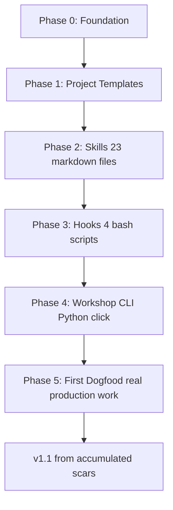
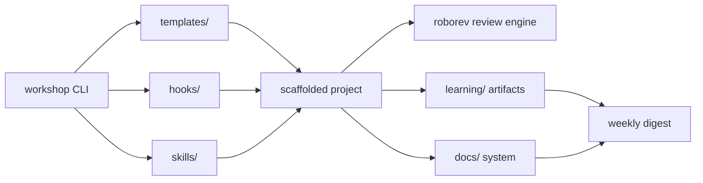
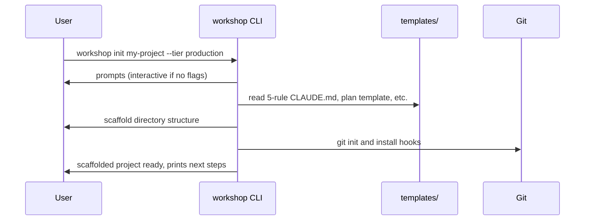
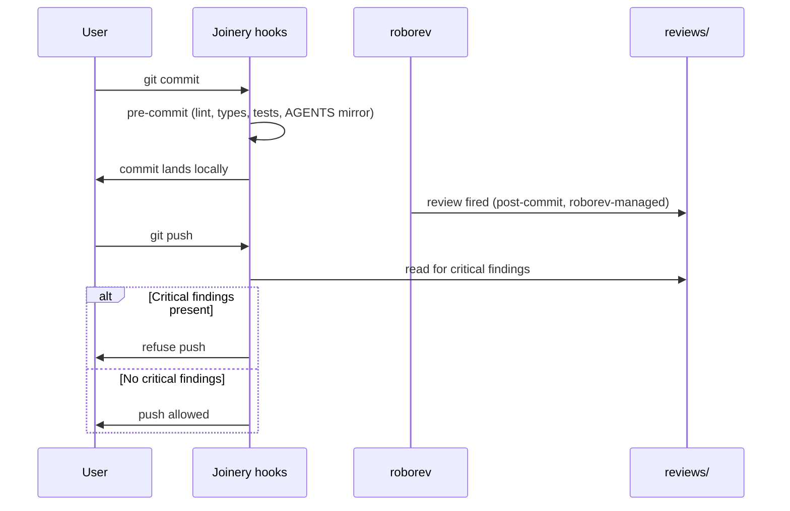

# Plan: Joinery v1

**Status:** complete (v0.1.0 shipped); awaiting first dogfood (Phase 5)
**Tier:** production
**Last updated:** 2026-05-10
**Related:** [`docs/spec.md`](docs/spec.md), [`docs/architecture.md`](docs/architecture.md), [`docs/decisions/0001-tier-as-risk-profile.md`](docs/decisions/0001-tier-as-risk-profile.md)

---

## 0. Context (prior planning)

The full design specification (~2000 lines, 18 sections) lives at `docs/spec.md` and was produced through ~6 sessions of iterative design (May 9-10, 2026). Research foundation is a 969-line practitioner survey covering 15 named developers and 20 tools, anchored by the convergent-pattern framing of "Adopt > Fork > Build."

Key load-bearing decisions made during design:
- Five phases (Sharpening / Drafting / Marking / Cutting / Finishing) as the work rhythm
- Three tiers (production / standard / sketch) as **risk profiles, not project categories**
- 23 composable skills organized by phase, mostly auto-invoking from natural language
- 4 git hooks (roborev manages the 5th — adversarial review)
- Workshop CLI in Python (click), distributed via `pipx install joinery-cli`
- Polyglot first-class: language is a hint, not a lock; hooks scan files at runtime
- Learning module always-on by default across all tiers (the framework's strongest non-negotiable)
- GitHub Flow branching with squash-merge as the default workflow on production tier
- ccstatusline as the v1 default for token visibility
- Roborev adopted as the adversarial review engine, with a graceful fallback if missing

This plan eats its own dogfood: Joinery's v1 build runs through Joinery's own discipline, even though the framework isn't fully assembled yet (production tier from Phase 0 onward).

## 1. Problem

Build a personal coding framework for the AI-agent era — a system of files, skills, hooks, and conventions that lets the user design, ship, and **understand** reliable software with strong agent leverage.

The framework needs to be:
- **Installable into any project** via `workshop init` with one command
- **Composable with existing tools** following the Adopt > Fork > Build discipline
- **Rigorous enough to trust on production work** (real money, real users, real consequences)
- **Lean enough to use in practice** (not a 13-section plan template that gets skipped)
- **Public-shareable** with no personal context bleeding into the framework code

The motivating problem is concrete: Anthropic's RCT shows 17% comprehension decline among AI-assisted developers. AI lets you ship faster but makes it easy to stop understanding what you ship. Joinery exists to keep AI leverage without becoming a passenger.

The framework's first user is the author. The first dogfood project will be real production work in production tier — exercising every framework feature in real conditions before anyone else relies on it.

## 2. Approach

The build is sequenced across 6 phases that climb a complexity ladder: pure files → markdown content → bash scripts → Python code → real use. Each phase has clear deliverables, completion criteria, and a quality bar. Stop criterion between phases: before moving on, you can cold-explain what got built and why.

**Files in scope:** entire repo. This is greenfield — every directory and file in `joinery/` is in scope across the 6 phases. Phase 0 specifically scopes to: `README.md`, `LICENSE`, `CLAUDE.md`, `AGENTS.md`, `plan.md` (this file), `docs/`, placeholder READMEs in empty directories, `pyproject.toml`, `.gitignore`.

## 3. Success criteria

**v1 build delivered as v0.1.0 on 2026-05-10.** All Phases 0-4 shipped via feature branches and squash-merged to main:

- Phase 0 — Foundation (repo skeleton, root docs, first ADR)
- Phase 1 — Project Templates (15 markdown + TOML templates)
- Phase 2 — Skills (23 skill files, post-audit-cut from 25)
- Phase 3 — Hooks (4 git hook bash scripts)
- Phase 4 — Workshop CLI (Python click app, 42 tests passing, mypy/ruff clean)

The framework is functionally complete and installable via `pip install -e .` from the repo. End-to-end smoke test verified: `workshop init` scaffolds correctly, `workshop doctor` reports cleanly.

**Phase 5 — First Dogfood** (next):
- [ ] First feature shipped end-to-end on real production work via Joinery
- [ ] At least 3 `/rule` commits captured from real friction
- [ ] Adversarial review fired on real diffs and produced actionable findings
- [ ] First weekly digest generated and read
- [ ] v1.1 plan emerges from accumulated scars

**Known v1 gaps** (deferred to v0.1.x or v1.1):
- `workshop setup` command not yet implemented (doctor flags `~/.config/joinery/ MISSING`; setup lands when first needed)
- External sync adapter pattern spec'd but no skeleton ships yet
- GitHub Actions CI workflow not yet added (lint/typecheck/tests run locally only)
- Cross-platform CI testing pending (Windows verified locally; Linux relies on pure stdlib + click + jinja2 portability)
- Deeper audit of `obra/superpowers` deferred to first real dogfood

## 4. Forbidden actions

- Do not commit personal context (specific project names, vault paths, individual usernames) into framework templates, skills, or code. Author attribution at the top of files is fine.
- Do not add features beyond the v1 spec scope without surfacing first. The spec is the contract for v1.
- Do not skip the audit-first step in Phase 2 (check existing tools before writing custom skills).
- Do not push directly to `main` on this repo. Production tier discipline applies — feature branches and PRs from Phase 0 onward.
- Do not bypass the comprehension gate. "Ship but don't understand" is a framework violation.
- Do not write code in Phase 0. This phase is structure only. Code lives in Phase 4.
- Do not use emojis in source files, configs, or commit messages. Markdown docs may use sparingly when they aid scanning, but err toward none.
- Do not reference tools or features that don't exist yet as if they exist. Phase 0's `pyproject.toml` declares `workshop = "joinery.cli:main"` as an entry point even though `joinery.cli` doesn't exist yet — that's a forward declaration, marked clearly. Other forward references must also be marked.

## 5. Side quests

Concepts encountered during this build that the user wants to surface for learning:

- [ ] **click** (Python CLI library, used in Phase 4) — command tree structure, `prompt=True` for interactive mode, context passing between commands, entry point declaration in `pyproject.toml`
- [ ] **hatchling** (Python build backend) — modern alternative to setuptools; how it differs, why this choice
- [ ] **pipx** — installs CLI tools in isolated venvs; how it differs from `pip install -g`, when to use which
- [ ] **roborev** (Phase 3 integration) — output format, hook lifecycle, the auto-fix loop, how to gate it per tier
- [ ] **biome** (TS toolchain, Phase 1 templates) — never used personally; what does it replace, what does its config look like
- [ ] **git hook lifecycle** — when each hook fires, what env vars are available, exit code semantics
- [ ] **Anthropic Skills format** — frontmatter conventions, auto-invocation triggers, what makes a "when to use" prompt good
- [ ] **Mermaid diagrams** — the syntax variants (graph TD, sequenceDiagram, erDiagram), where they render in markdown viewers

These will get logged to `learning/side-quests.md` once Phase 1 scaffolds the learning directory. For Phase 0, this section is the standing record.

## 6. Data model (CONDITIONAL)

N/A. The framework itself has no persistent state beyond config files and markdown artifacts in git. (Projects scaffolded BY Joinery may have data models — that's their concern, captured in their own `plan.md`.)

## 7. Critical flows (CONDITIONAL)

The two most important framework flows:

**Workshop init flow:**

**Commit and push flow on production tier:**

---

## Decisions log

Decisions made during the build will be appended here as ADRs are written:

- [ADR-0001](docs/decisions/0001-tier-as-risk-profile.md) — Tiers are risk profiles, not project categories
