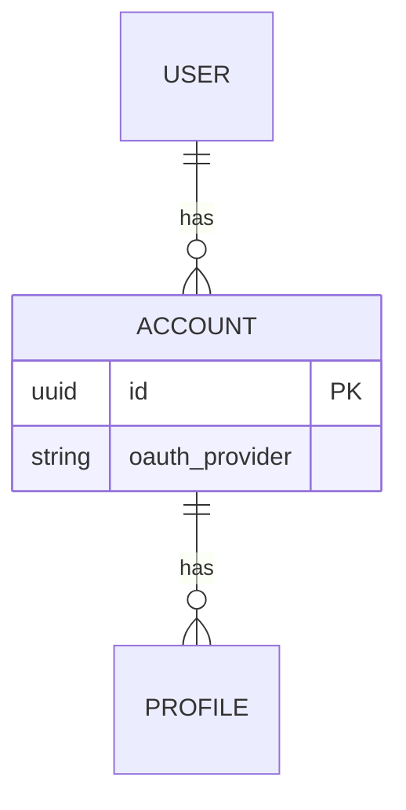

# /plan-data — data model

## When to use

CONDITIONAL. Only when the system has persistent state (database, files surviving restarts, durable queue, etc.). Skip for stateless utilities, transformations, or pure functions.

Triggers:
- "data model for X" / "database schema" / "ER diagram"
- "what entities does X need"
- Composed by `/plan` when persistent state surfaces during planning

## Procedure

1. **Identify entities.** What things does the system persist? Each entity becomes a box in the ER diagram.

2. **Identify relationships.** One-to-one, one-to-many, many-to-many. Mermaid ER syntax handles all three.

3. **Decide field-level details only when load-bearing.** ER diagrams at the planning stage show entity shape and relationships, not every field. Fields that affect the design (composite keys, soft-delete columns, partition keys) earn mention. Boilerplate fields (id, created_at, updated_at) don't.

4. **Surface non-trivial decisions in prose.** "Why a separate Profile table from Account" type questions. Goes in the brief notes alongside the diagram.

5. **Note the migration path** if extending an existing schema. Even a sentence: "This adds the `webhooks` table; no changes to existing tables."

## Output format

The Data model section of `plan.md`:

````markdown
## 6. Data model



**Entity decisions:**
- `Account` is split from `User` because OAuth providers create multiple Accounts per User (one per provider).
- `Profile` is per-Account, not per-User, so different OAuth identities can show different display preferences.

**Migration path:** new table `webhooks`; no changes to `users` or `accounts`.
````

## Notes

- Skip if no persistent state. Forcing this section on stateless work is template ceremony.
- Field-level details come during cutting (Phase 4), not planning. Don't pre-design every column.
