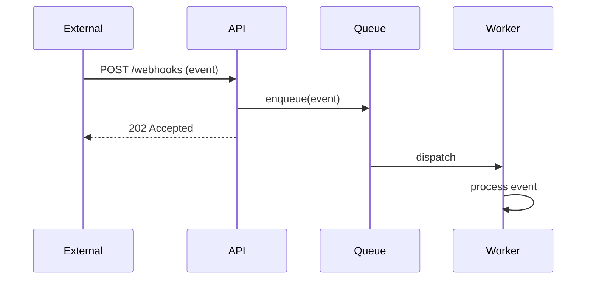
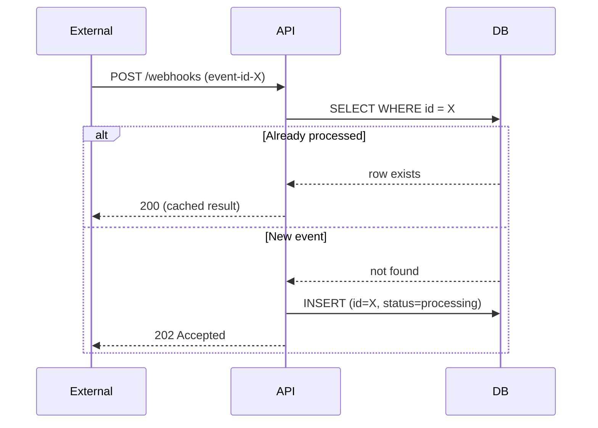

# /plan-flows — critical interaction flows

## When to use

CONDITIONAL. Only when the system has non-trivial interactions across components or with external systems. Skip if there's one obvious flow that prose can describe.

Triggers:
- "sequence diagram for X" / "show the flow"
- "how does X interact with Y"
- "what's the interaction pattern between A and B"
- Composed by `/plan` when complex flows surface during planning

## Procedure

1. **Identify the load-bearing flows.** 2-3 maximum. Pick the flows that most influence the design — happy path, primary failure mode, retry/replay logic, etc.

2. **For each flow, identify participants.** User, frontend, API, database, external service, etc. Keep to 4-6 participants per diagram.

3. **Draw the sequence.** Mermaid `sequenceDiagram` syntax. Use `alt` blocks for branches (success vs failure). Use `Note over` sparingly for context that doesn't fit in arrow labels.

4. **Caption each flow.** One-sentence description above each diagram so a reader knows what they're looking at without parsing the syntax.

5. **Surface implications.** If the flow reveals a constraint or design implication (e.g., "this requires idempotency keys"), note it after the diagram.

## Output format

The Critical flows section of `plan.md`:

````markdown
## 7. Critical flows

**Happy path: webhook ingestion.**



**Implication:** Workers are async; clients get 202 not 200. They cannot expect immediate processing.

**Replay flow: idempotent retries.**



**Implication:** Every webhook event MUST have a stable event-id from the sender.
````

## Notes

- 2-3 flows max. More than 3 is implementation detail — save for actual code.
- Caption matters. A diagram without context is decoration.
- Failure paths matter as much as happy paths. The retry/replay flow often reveals constraints.
