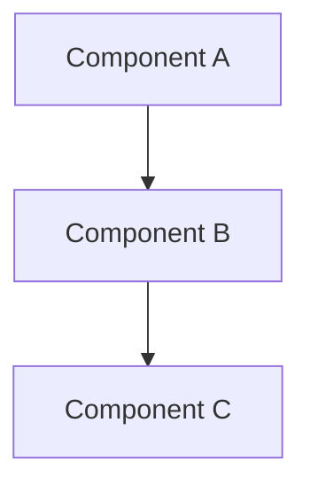

# /plan-system — system architecture sketch

## When to use

- Composed by `/plan` when drafting the Approach section
- Manually invoked when the architecture needs standalone treatment ("draw the architecture for X")

## Procedure

1. **Read context.** Existing `plan.md` if present, recent commits, relevant code, `docs/architecture.md`.

2. **Identify components.** What are the meaningful parts of this system? Aim for 3-7 boxes — fewer is too vague, more is implementation detail.

3. **Identify connections.** What flows between components? Data, control, dependencies?

4. **Draw the Mermaid diagram.** Use `graph TD` (top-down) or `graph LR` (left-right) per readability. Keep node names short. No emojis in the diagram.

5. **List Files in scope.** Concrete paths the agent is allowed to touch during cutting. Include test files alongside source files.

6. **Write the "what could go wrong" paragraph.** Inline at the end of Approach. Surface failure modes the design must handle. Not a full risk register — just the load-bearing concerns that shape the design.

## Output format

The Approach section of `plan.md`:

````markdown
## 2. Approach

<One paragraph stating the strawman approach in plain English.>



<What could go wrong: one paragraph flagging the load-bearing risks.>

**Files in scope:**
- `src/path/to/file.ts`
- `src/path/to/test.ts`
````

## Notes

- 3-7 components in the diagram. Cut nodes that don't earn their place.
- File paths must exist or be planned to exist. No phantom paths.
- Risks live inline, not as a separate Section. Per spec §6, "Risks + threats" was deliberately folded into Approach.
